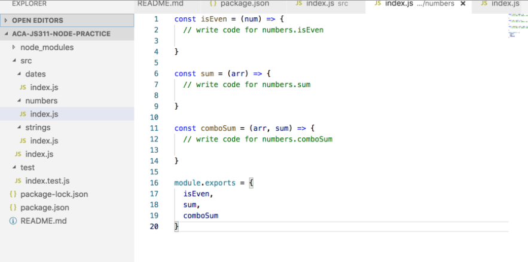

# Class 1: Get Familiar with Node, NPM, & Postman

<!-- ! HIDE FROM STUDENT; INSTRUCTOR ONLY CONTENT -->
<!-- ## Instructor Only Content - HIDE FROM STUDENTS -->

<!-- ! END INSTRUCTOR ONLY CONTENT -->

*Well begun is half done. —Greek Proverb*

## Greet, Outline, and Objectify

<!-- SMART: Specific, Measurable, Attainable, Relevant, and Timely. -->
<!-- https://examples.yourdictionary.com/well-written-examples-of-learning-objectives.html -->

Today we're going to:
  
*OBJECTIVE - Today the student will learn and practice to understand:*

* *Node.js*
* *Test software: Postman*
* *Program using remote API*

*****

- [ ] Introductions
- [ ] Questions for Student Led Discussion
- [ ] Interview Challenge
- [ ] Plan and organize Daily Student Presentations
- [ ] Creation Time
    * [ ] Download and follow the `README.md` in the [Node Repo](https://github.com/AustinCodingAcademy/JS311-node-practice)
    * [ ] Download and practice Postman against the Pokemon API
- [ ] Push Yourself Further
    * [ ] Build a word-count algorithm
    * [ ] Look for Charizard!
- [ ] Exit Recap, Attendance, and Reminders

### Introductions

*Since we don't know each other, at least not your instructor, everyone should answer these questions aloud:*

- [ ] Hey, my name is . . .
- [ ] I currently work as a . . . but I love to spend my time . . .
- [ ] I'm excited about learning to program because . . .
- [ ] My best time to do a study group or tutoring is . . . (example: Mondays at noon.)

### Questions for Student Led Discussion, 15 mins
<!-- This section should be structured with the 5E model: https://lesley.edu/article/empowering-students-the-5e-model-explained -->

[Questions to prompt discussion](./../additionalResources/questionsForDiscussion/qfd-class-1.md)

### Interview Challenge, 20 mins
<!-- The last two E happen here: elaborate and evaluate  -->
<!-- this sections should have a challenge that can be solved with the skills they've learned since their last class. -->
<!-- ! HIDDEN CONTENT: INSTRUCTOR ONLY -->
[See Your Challenge Here](./../additionalResources/interviewChallenges.md)
<!-- ! END HIDDEN CONTENT: INSTRUCTOR ONLY -->

### Student Presentations, 10 mins

[See Student Presentations List](./../additionalResources/studentPresentations.md)

## Creation Time, 60-90 mins

### Node/NPM Recap

Today we'll recap Node.js and NPM. The goal of this assignment is to complete a set of functions so that all of the tests pass. Additionally, one set of functions will use a popular NPM package, moment.js, to help us format dates and times.

 - [ ] Fork and clone the following repository: [Node Practice](https://github.com/AustinCodingAcademy/JS311-node-practice).
- [ ] Follow the `README` to complete the functions and make all the tests pass.

<iframe src="https://giphy.com/embed/7zxlYmtxartdsUx6sq" width="100%" height="100%" style="position:absolute" frameBorder="0" class="giphy-embed" allowFullScreen></iframe>

<a href="https://giphy.com/gifs/7zxlYmtxartdsUx6sq">via GIPHY</a>

* [YT, Programming with Mosh - JS Array.Reduce](https://youtu.be/g1C40tDP0Bk)

### Learn to Use Postman

Today you'll download Postman and become familiar with its interface for making API calls. The instructor will come around to ensure the tool is correctly installed and you have an understanding of its purpose.

* [YT, Raghav Pal - Postman Tutorial Ep. 1: What is Postman?](https://www.youtube.com/watch?v=juldrxDrSH0&list=PLhW3qG5bs-L-oT0GenwPLcJAPD_SiFK3C)
* [Postman Docs - Install & Introduction](https://learning.getpostman.com/docs/postman/launching_postman/installation_and_updates/)

- [ ] [Download Postman](https://www.getpostman.com/downloads/).
- [ ] Open the application.
- [ ] Make a `GET` request to the Star Wars API: `https://swapi.dev/api`.
- [ ] You should have received a list of available endpoints . . . make a request to the `planets` one.
- [ ] What's the diameter of `Naboo`?

  > Back up: In case SWAPI isn't up use [ReqRes](https://reqres.in/)

* [YT, Raghav Pal - Postman Tutorial Ep.2: Postman's UI](https://youtu.be/hHV0OZa4zrQ)
* [YT, Raghav Pal - Postman Tutorial Ep.3: Create a Request](https://youtu.be/cR_FqveTewo)

### 

### Push Yourself Further

- [ ] [Repl.it, Matt Viteri - Word Count](https://replit.com/@MattViteri/Word-Count)
- [ ] Using Postman and the Pokemon API:
    *  [ ] Use the Pokemon API to find the Pokemon `Charizard`.
    *  [ ] The base URL is: `https://pokeapi.co/api/v2/pokemon/`.
    *  [ ] Make a GET request and use a path parameter of the Pokemon's name to access information about it.
    *  [ ] Use the information provided to lookup `Charizard`'s "type".
    *  [ ] Access the corresponding endpoint to find more details about the "fire" type.
    *  [ ] Locate the list of moves associated with this type.

## Student Feedback

<iframe src="https://docs.google.com/forms/d/e/1FAIpQLSd85nNCk_MdnaXCsX7fWl3vYgcqvozzlK2cKq26d2g67Zh8Kg/viewform?embedded=true" width="640" height="600" frameborder="0" marginheight="0" marginwidth="0">Loading…</iframe>

## Exit Recap, Attendance, and Reminders, 5 mins

- [ ] Prepare for next class by completing all of your pre-class lessons
- [ ] Complete the feedback survey

<!-- <iframe id="openedx-zollege" src="https://openedx.zollege.com/feedback" style="width: 100%; height: 500px; border: 0">Browser not compatible.</iframe>
 -->

<!-- TODO Create 3 question exit questions -->

<!-- TODO INSERT Student Feedback From -->

<!-- TODO INSERT *HIDDEN* Instructor Feedback Form -->
