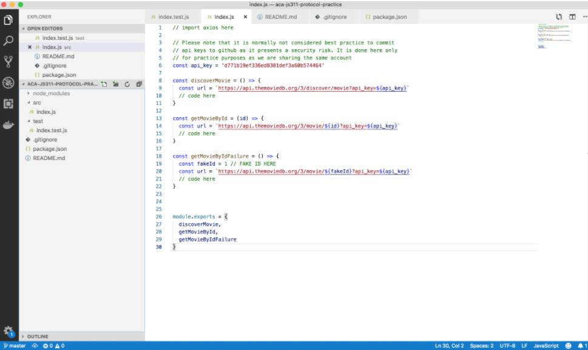

# Class 2: HTTP Request with Axios

<!-- ! HIDE FROM STUDENT; INSTRUCTOR ONLY CONTENT -->
<!-- ## Instructor Only Content - HIDE FROM STUDENTS -->

<!-- ! END INSTRUCTOR ONLY CONTENT -->

*The best way out is always through. —Robert Frost*

## Greet, Outline, and Objectify

<!-- SMART: Specific, Measurable, Attainable, Relevant, and Timely. -->
<!-- https://examples.yourdictionary.com/well-written-examples-of-learning-objectives.html -->

Today we're going to:
  
*OBJECTIVE - Today the student will learn and practice to understand:*

* *Practice passing Jest Tests*
* *Using Axios as an HTTP Client*

*****

- [ ] Questions for Student Led Discussion
- [ ] Interview Challenge
- [ ] Student Presentations
- [ ] Creation Time
    * [ ] Fork and Clone the [Axios Practice Repo](https://github.com/AustinCodingAcademy/311_wk1_day2_axios){:target="_blank"}
- [ ] Push Yourself Further
- [ ] Blog to Show You Know
- [ ] Exit Recap, Attendance, and Reminders

### Questions for Student Led Discussion, 15 mins
<!-- This section should be structured with the 5E model: https://lesley.edu/article/empowering-students-the-5e-model-explained -->

[Questions to prompt discussion](./../additionalResources/questionsForDiscussion/qfd-class-2.md)

### Interview Challenge, 15 mins
<!-- The last two E happen here: elaborate and evaluate  -->
<!-- this sections should have a challenge that can be solved with the skills they've learned since their last class. -->
<!-- ! HIDDEN CONTENT: INSTRUCTOR ONLY -->
[See Your Challenge Here](./../additionalResources/interviewChallenges.md)
<!-- ! END HIDDEN CONTENT: INSTRUCTOR ONLY -->

### Student Presentations, 15 mins

[See Student Presentations List](./../additionalResources/studentPresentations.md)

## Creation Time, 60-90 mins

Today we are going to be making API calls with Axios. The goal of this exercise is to get comfortable using axios (like fetch) in a Node.js environment and familiarizing ourselves with the types of responses and status codes we receive from APIs.

- [ ] Fork and clone the following repository: [Axios Practice](https://github.com/AustinCodingAcademy/311_wk1_day2_axios){:target="_blank"}.
- [ ] Follow the `README` to complete the functions and make all the tests pass.

### Follow Up Video

- [ ] [YT, Mahtab Alam - Making HTTP Calls in Node with Axios.js](https://youtu.be/vNYZQ2Bqg_0){:target="_blank"}

### Push Yourself Further

- [ ] [Medium Tutorial, Sebastian Eschweiler - Getting Started with Axios.js](https://medium.com/codingthesmartway-com-blog/getting-started-with-axios-166cb0035237){:target="_blank"}

## Student Feedback

<iframe src="https://docs.google.com/forms/d/e/1FAIpQLSd85nNCk_MdnaXCsX7fWl3vYgcqvozzlK2cKq26d2g67Zh8Kg/viewform?embedded=true" width="640" height="600" frameborder="0" marginheight="0" marginwidth="0">Loading…</iframe>

## Blogs to Show You Know

[Blog Prompts](./../additionalResources/blogPrompts.md)

## Exit Recap, Attendance, and Reminders, 5 mins

- [ ] Create Axios Practice Assignment
- [ ] Create Class 2 Blog To Show You Know Assignment
- [ ] Prepare for next class by completing all of your pre-class lessons
- [ ] Complete the feedback survey

<!-- <iframe id="openedx-zollege" src="https://openedx.zollege.com/feedback" style="width: 100%; height: 500px; border: 0">Browser not compatible.</iframe>
 -->

<!-- TODO Create 3 question exit questions -->

<!-- TODO INSERT Student Feedback From -->

<!-- TODO INSERT *HIDDEN* Instructor Feedback Form -->
