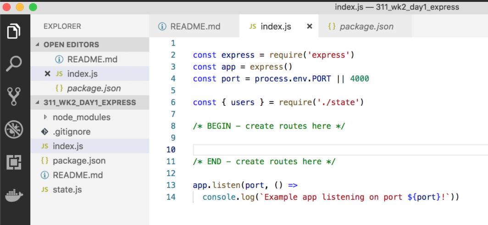
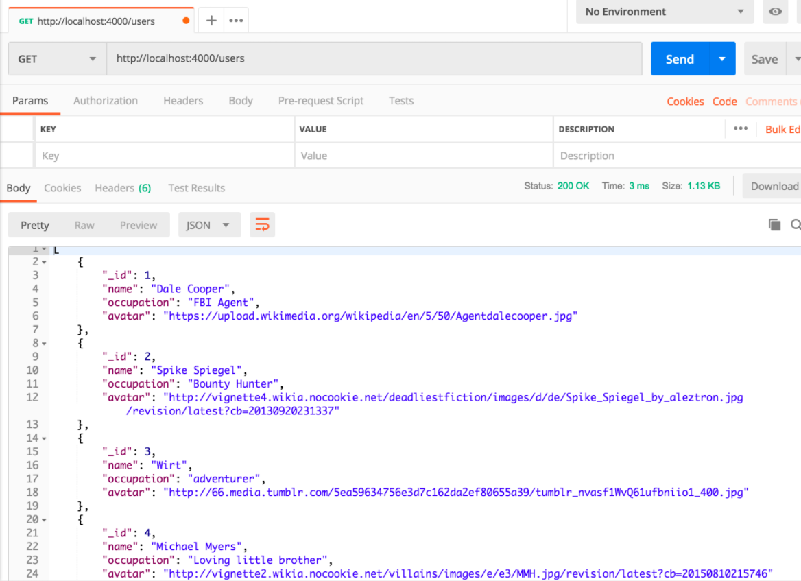

# Class 3: 1st Express Server

<!-- ! HIDE FROM STUDENT; INSTRUCTOR ONLY CONTENT -->
<!-- ## Instructor Only Content - HIDE FROM STUDENTS -->

<!-- ! END INSTRUCTOR ONLY CONTENT -->

*The surest way not to fail is to determine to succeed. —Richard Brinsley Sheridan*

## Greet, Outline, and Objectify

<!-- SMART: Specific, Measurable, Attainable, Relevant, and Timely. -->
<!-- https://examples.yourdictionary.com/well-written-examples-of-learning-objectives.html -->

Today we're going to:
  
*OBJECTIVE - Today the student will learn and practice to understand:*

* *Using Express.js to build JavaScript servers*
* *Using Postman as a testing software*

*****

- [ ] Questions for Student Led Discussion
- [ ] Interview Challenge
- [ ] Student Presentations
- [ ] Creation Time
    - [ ]  [311_wk2_day1_express repo](https://github.com/AustinCodingAcademy/311_wk2_day1_express.git)
    - [ ]  Complete the Express server
    - [ ]  Test with Postman
- [ ] Push Yourself Further
- [ ] Exit Recap, Attendance, and Reminders

### Questions for Student Led Discussion, 15 mins
<!-- This section should be structured with the 5E model: https://lesley.edu/article/empowering-students-the-5e-model-explained -->

[Questions to prompt discussion](./../additionalResources/questionsForDiscussion/qfd-class-3.md)

### Interview Challenge, 15 mins
<!-- The last two E happen here: elaborate and evaluate  -->
<!-- this sections should have a challenge that can be solved with the skills they've learned since their last class. -->
<!-- ! HIDDEN CONTENT: INSTRUCTOR ONLY -->
[See Your Challenge Here](./../additionalResources/interviewChallenges.md)
<!-- ! END HIDDEN CONTENT: INSTRUCTOR ONLY -->

### Student Presentations, 15 mins

[See Student Presentations List](./../additionalResources/studentPresentations.md)

## Creation Time, 60-90 mins

Today we are going to set up a basic Express server and add a few routes. We will practice creating/altering routes and seeing the results in Postman.

- [ ] Fork and clone the following repository: [Express Intro Practice](https://github.com/AustinCodingAcademy/311_wk2_day1_express)
`cd` into the new directory and `npm i`
- [ ] Follow the `README` to:
    - [ ]  get started
    - [ ]  build routes and
    - [ ]  test them with Postman
- [ ] Remember to use the homework for this class to build your first routes.

- [ ] [YT, Traversy Media - JS Crash Course](https://youtu.be/L72fhGm1tfE)

    > This video is an hour and fourteen minutes long but it covers all the topics we learned today. It uses Express and Postman. You might try listening at 1.5x speed but you should definitely follow along.

### Push Yourself Further

Follow along with this [tutorial on installing and setting up express](https://www.robinwieruch.de/node-js-express-tutorial/). This article includes concepts like "middleware" which we practiced with body-parser but haven't talked about in depth yet.

## Student Feedback

<iframe src="https://docs.google.com/forms/d/e/1FAIpQLScjuL10i2xFGMWRwkjtgAL8F1Y5ipMPPjtTCDzkO1ZBcxUYZA/viewform?embedded=true" width="640" height="500" frameborder="0" marginheight="0" marginwidth="0">Loading…</iframe>

## Exit Recap, Attendance, and Reminders, 5 mins

<!-- - [ ] Create Class ** Blog To Show You Know Assignment -->
- [ ] Prepare for next class by completing all of your pre-class lessons
- [ ] Complete the feedback survey

<!-- <iframe id="openedx-zollege" src="https://openedx.zollege.com/feedback" style="width: 100%; height: 500px; border: 0">Browser not compatible.</iframe>
 -->

<!-- TODO Create 3 question exit questions -->

<!-- TODO INSERT Student Feedback From -->

<!-- TODO INSERT *HIDDEN* Instructor Feedback Form -->
