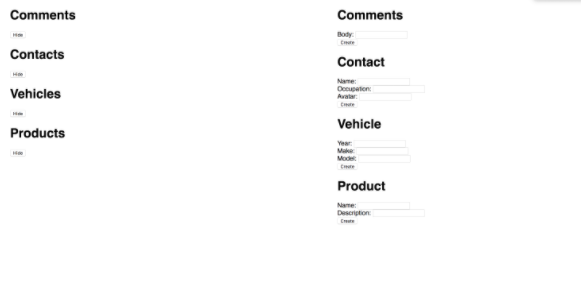

# Class 4: Serving Static Files

<!-- ! HIDE FROM STUDENT; INSTRUCTOR ONLY CONTENT -->
<!-- ## Instructor Only Content - HIDE FROM STUDENTS -->

<!-- ! END INSTRUCTOR ONLY CONTENT -->

*A failure is a man who has blundered, but is not able to cash in on the experience. —Elbert Hubbard*

## Greet, Outline, and Objectify

<!-- SMART: Specific, Measurable, Attainable, Relevant, and Timely. -->
<!-- https://examples.yourdictionary.com/well-written-examples-of-learning-objectives.html -->

Today we're going to:
  
*OBJECTIVE - Today the student will learn and practice to understand:*()

* *Building routers and controllers with Express.js*
* *Saving data to and generating a static file*

*****

- [ ] Questions for Student Led Discussion
- [ ] Interview Challenge
- [ ] Student Presentations
- [ ] Creation Time
    - [ ]  Fork and clone the Repo
    - [ ]  Create routers, controllers and static files, REPEAT!!
- [ ] Blog to Show You Know
- [ ] Exit Recap, Attendance, and Reminders

### Questions for Student Led Discussion, 15 mins
<!-- This section should be structured with the 5E model: https://lesley.edu/article/empowering-students-the-5e-model-explained -->

[Questions to prompt discussion](./../additionalResources/questionsForDiscussion/qfd-class-4.md)

### Interview Challenge, 15 mins
<!-- The last two E happen here: elaborate and evaluate  -->
<!-- this sections should have a challenge that can be solved with the skills they've learned since their last class. -->
<!-- ! HIDDEN CONTENT: INSTRUCTOR ONLY -->
[See Your Challenge Here](./../additionalResources/interviewChallenges.md)
<!-- ! END HIDDEN CONTENT: INSTRUCTOR ONLY -->

### Student Presentations, 15 mins

[See Student Presentations List](./../additionalResources/studentPresentations.md)

## Creation Time, 60-90 mins

Today we are going to work with three new ways to organize our express server. We will create routers, controllers and use `express.static` to render the files in the public folder. The result will be an all-in-one website you can interact with.

{:target="_blank"}

- [ ] Fork and clone the following repository: [Express Continued Practice](https://github.com/AustinCodingAcademy/311_wk2_day2_express-continued){:target="_blank"}
- [ ] Follow the `README` to build routes, controllers and serve static files
- [ ] [YT, BuzzTeam - Express.JS: You First Controller](https://youtu.be/R30BJ-XBthI){:target="_blank"}

<!-- ! Video Content:  (width="655" height="368", ratio 1.77) -->

### Push Yourself Further

- [ ] Complete the following Mozilla tutorial on [routes and controllers](https://developer.mozilla.org/en-US/docs/Learn/Server-side/Express_Nodejs/routes){:target="_blank"}

## Student Feedback

<iframe src="https://docs.google.com/forms/d/e/1FAIpQLSd85nNCk_MdnaXCsX7fWl3vYgcqvozzlK2cKq26d2g67Zh8Kg/viewform?embedded=true" width="640" height="600" frameborder="0" marginheight="0" marginwidth="0">Loading…</iframe>

## Blogs to Show You Know

[Blog Prompts](./../additionalResources/blogPrompts.md)

## Exit Recap, Attendance, and Reminders, 5 mins

- [ ] Create Class 4 Blog To Show You Know Assignment
- [ ] Prepare for next class by completing all of your pre-class lessons
- [ ] Complete the feedback survey

<!-- <iframe id="openedx-zollege" src="https://openedx.zollege.com/feedback" style="width: 100%; height: 500px; border: 0">Browser not compatible.</iframe>
 -->

<!-- TODO Create 3 question exit questions -->

<!-- TODO INSERT Student Feedback From -->

<!-- TODO INSERT *HIDDEN* Instructor Feedback Form -->
