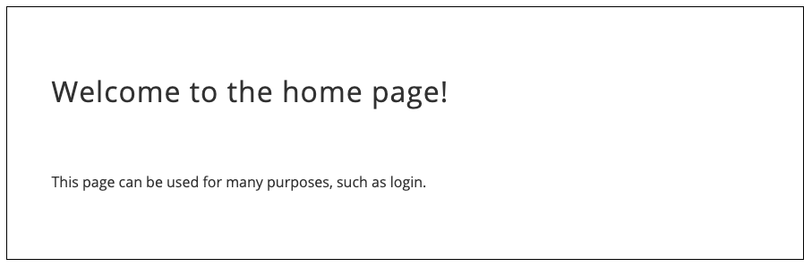

# Serving Static Files in Express.js

## Overview

**Static files** are plain files. While there are a few definitions of the term **"static"** in programming, we won't get into that here. We simply need to know that it's a collection of files/folders. The files could be JavaScript, HTML, CSS, etc. What's the point?

Well . . . you might want to show a specific HTML page when the user navigates to the main route `"/"`. In a more complex example, we may create a front-end with [create-react-app](https://reactjs.org/docs/create-a-new-react-app.html){:target="_blank"} and when we are ready for production we can compile the app into a collection of files and have the server display those to the user.

## How to Serve Static Files

In order to use static files we use the built in `.static` method of express as middleware. For example:

```javascript
  app.use(express.static('public'))
```

This tells express to show the contents of the "public" folder when a user navigates to the web server. In a more complete example, our `index.js` file looks like this:

=== "index.js"

    ```javascript
      const express = require('express')
      const app = express()

      const port = process.env.PORT || 4000

      // tell our Express server to serve the files in the public folder
      app.use(express.static('public'))

      app.listen(port, () =>
        console.log(`App is listening on port: ${port}!`))
    ```

=== "Folder Structure"

    ```console
    src/
      - index.js
      - controllers/
        - users.js
      - routers/
        - users.js
        - customers.js
        - merchants.js
        - admins.js
      - public/
        - index.html
    ```

=== "public/index.html Code"

    ```html
      <html>
        <head>
          <title>Home Page</title>
        </head>

        <body>
          <h1>Welcome to the home page!</h1>
          <p>This page can be used for many purposes, such as login.</p>
        </body>

      </html>
    ```

=== "Rendered at `http://localhost:4000/`"

    

## Practice It

<div id="i4c-draggable-container" style="position: fixed; z-index: 1499; width: 0px; height: 0px;">
<div data-reactroot="" class="resolved" style="all: initial;"></div>
</div>
<p><iframe height="600px" width="100%" src="https://repl.it/@MattViteri/StarkCanineCrypto?lite=true" scrolling="no" frameborder="no" allowtransparency="true" allowfullscreen="true" sandbox="allow-forms allow-pointer-lock allow-popups allow-same-origin allow-scripts allow-modals"></iframe></p>
<p></p>
<div id="i4c-dialogs-container"></div>
<div></div>
<div id="i4c-dialogs-container"></div>
<div id="i4c-dialogs-container"></div>
<div id="i4c-dialogs-container"></div>

Use the sandbox above to get familiar with routes and controllers

- [ ] Click the start button and run the server
- [ ] Interact with the routes via Postman. You will find the [URL](https://starkcaninecrypto--mattviteri.repl.co/) on the right side of your screen after you open the Repl.it (top-right).
- [ ] Verify that all the routes work as intended
- [ ] Test `/users`, `/users/2`
- [ ] Move the routes in `index.js` over to the `routes/users.js` folder and import/`require()` them back into `index.js` using `const users = require('./routers/users.js')` & `app.use()`
- [ ] Move the `(req, res) => {}` functions out of the routes and into the `controllers/` folder. Then import these back into the `routes/` folder as you did before and use as expected: `app.get('/users', usersController.list)`
- [ ] If everything was done correctly the app will function exactly as it was in the beginning.
- [ ] Test with Postman as you do each small step. **TEST**! **TEST**!! **TEST**!!
- [ ] Once you've move your routes and built your controllers practice building the routes to create a user!!
- [ ] Remember to reference your docs!!

## Additional Resources

- [ ] [YT, Codedamn - ExpressJS 15: Serving Static Files](https://youtu.be/7UErZ43jzrU){:target="_blank"}

## Know Your Docs

- [ ] [Express Docs - Static](https://expressjs.com/en/starter/static-files.html){:target="_blank"}
