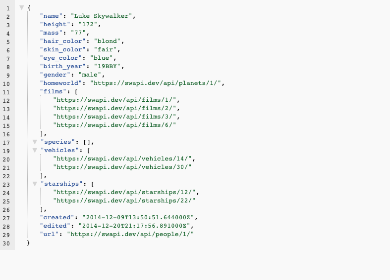
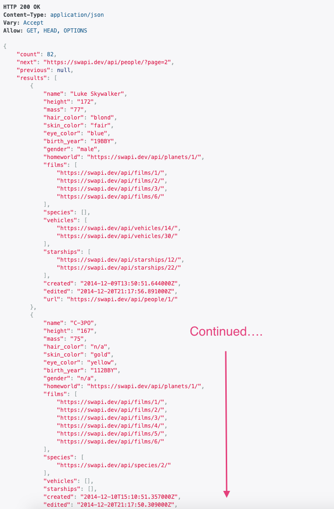

# What is REST

**REST** stands for **RE**presentational **S**tate **T**ransfer. It is an architectural style, or *a set of guiding principles*, for building distributed systems. [This site](https://restfulapi.net/) provides an overview of these principles and the history of REST. Systems that adhere to these principles are commonly said to be **RESTful**.

We're not going to focus too much on the theory behind REST. Instead, we'll focus on the practical application of REST to APIs, using common industry patterns. Still, there are a few terms and concepts that we must review.

## What's a Resource?

A **resource** is key concept in REST. It's a general term that represents any information that can be named. Resources are often the basic data entities that our APIs work with, but they can also be more abstract concepts or processes. In the Star Wars API, the resources are things like "people", "starships", and "planets".

Resources are commonly named using plural nouns. For example, to access information about the people in Star Wars, we use "people" rather than the singular "person".

By convention, resource names are usually expressed as nouns rather than verbs or actions. E.g., planets rather than `getPlanet`, or `StudentEnrollment` rather than `EnrollStudent`.

Occasionally, resources can also be more abstract concepts or processes. For example, a "StudentEnrollment" resource might be a multi-step process that updates Student and Class resources, while also enforcing rules about which classes a student can enroll in, sending notifications, and so on.

## The URI Part

Resources are accessed using **U**niform **R**esource **I**dentifiers, or **URI**s. URIs are very similar to the familiar URL(**UR Locator**) that we use on the web. *There are [subtle theoretical differences between URIs and URLs that we will not concern ourselves with, but you can read more about](https://danielmiessler.com/study/url-uri/)... if you're interested.*

Let's revisit the URI that we used to access information about Luke Skywalker:

=== "The Request's URI"

    ```markdown
      https://swapi.dev/api/people/1
    ```

=== "The Response"

    

    > NOTE: Paste in the URI into your browsers address bar. You can make your responses easier to read using the [JSON Formatter Extension for Chrome](https://chrome.google.com/webstore/detail/json-formatter/mhimpmpmffogbmmkmajibklelopddmjf/related).

| Part| Explanation |
| --- | --- |
| `https://swapi.dev/api`	| The base URL for accessing the API. This includes the protocol that will be used `https`, the location of the API `swapi.dev`, and a base path `/api` to find the resource.|
| `/people`	| The resource we're accessing, `people`|
| `/1`	| An identifier that tells the API which person we're interested in: `1`|

*****

Here's another example.

  > Note that we don't specify an ID for any particular person. Instead, we're accessing all people.

=== "The Requests URI"

    ```markdown
      https://swapi.dev/api/people
    ```

=== "The Response"

    

| Part | Explanation|
| --- | --- |
| `https://swapi.dev/api`	| The base URL for accessing the API|
| `/people`	| The resource we're accessing, `people`|

*****

## Using REST APIs

To interact with REST APIs we'll need to understand three things: 

* Clients and Servers: the two parties. Clients request and Servers respond.
* The Protocol: When the two parties communicate they have to use the same protocol so they understand each other.
* Tools: You have three tools to use on your Client to request data from a REST API

### Clients and Servers

You're going to hear the terms **client** and **server** a lot, so let's make sure we understand what they mean.

The client-server model is a way of distributing work among multiple parts of a software system, with the parts often (but not necessarily) running on separate computers and communicating over a network.

For example, when we click the [https://swapi.dev/api/people/1](https://swapi.dev/api/people/1?format=json) link, our web browser is the **client**. And the computer at swapi.dev, that sends back the data about Luke Skywalker, is the **server**.

In general, software making a request is a **client**. Software that listens for **requests** and sends back a **response** is a **server**. **Request** and **response** are important concepts that we'll be working with as we build APIs.

### The Protocol: HTTP/HTTPS

**H**yper **T**ext **T**ransfer is the **P**rotocol is that clients and servers use to communicate on the web. HTTPS is a more secure version of HTTP in which the information being exchanged is encrypted. The first part of a URI (e.g., HTTP:) indicates which protocol is being used so the client and server know how to talk to each other, *it sets the rules for the conversation*. Technically, a REST API can use any protocol to communicate, but in practice they usually use HTTP or HTTPS (The **S** stands for *Secure*).

HTTP has two types of messages: **requests** and **responses**. A request object is sent and the appropriate thing to send back is a response object. We won't necessarily be creating request and response messages from scratch, we have frameworks and other tools to help with that, but we will be working with some of their parts and it is good to have a mental picture of what these message objects look like.

A **request** message/object is made up of the following main parts:

| Part | Explanation|
| --- | --- |
| **Request Method** | Also commonly called the verb, the request method indicates what type of action we're requesting. Some commonly used methods are GET, PUT, DELETE, and POST.|
| **Path** | The path to the resource that we're working with.|
| **Headers** | A collection of colon-separated key-value pairs that can be used to provide additional context about the request, e.g. Content-Type: application/json (which indicates that the content of the body will be in JSON format.)|
| **Body** | A payload that can be sent with the request.|

A **response** message/object has these parts:

| Part | Explanation|
| --- | --- |
| Status Code / Message	| A numeric code and short message that indicate whether the request was successful.|
| Headers	| A collection of colon-separated key-value pairs that can be used to provide additional context about the response, e.g., Content-Type: application/json indicates that the content of the body is in JSON format.|
| Body	| A payload that can be sent with the response.|

You can find more detailed [information about HTTP here](https://developer.mozilla.org/en-US/docs/Web/HTTP/Overview#Requests).

### Tools to Interact with REST APIs

Up to this point, we've interacted with the Star Wars API by using a browser. This is convenient but limiting. The browser's address bar and links can only make one type of request, known as a **GET** request, which is used (unsurprisingly) to *get* a resource. But what if we want to create, update, or delete a resource? We either have to write code or use another tool. Fortunately, there is a powerful and free tool called [Postman](https://www.postman.com/) that we can use to more fully interact with REST APIs.

### Postman

In the following video, we'll look [at another API](https://reqres.in/), provided by [Ben Howdle](https://github.com/benhowdle89), and dig in to the full range of request types and how they're used in REST APIs. First we'll explore the API using the interface provided by the website and then we'll use Postman to interact with the API.

<!-- !Video Content: 321: Using Postman -->
<iframe src="https://player.vimeo.com/video/344941801?byline=0&portrait=0" width="655" height="368" frameborder="0" allow="autoplay; fullscreen" allowfullscreen></iframe>

### Curl

We've learned the basics of what an API is today and touched on how to make a call but another way to make an API request is using something called `curl`. `curl` is a way to make calls using your terminal and getting information back sometimes faster and more efficiently. Its good to understand alternative ways to make requests and `curl` can be another strong choice to make requests. Simply follow these steps and you can practice using `curl`. To install `curl` you can follow instructions on their website (see [Additional Resources](#Additional-Resources) below).

- [ ] Check to see if `curl` is already installed `curl --version`
  > NOTE: curl is default command most computers already have installed.
- [ ] If `curl` is not already installed [download `curl`](https://curl.se/docs/install.html)
  > NOTE: If you have Homebrew installed you can also run the command `brew install curl`.
- [ ] Check Version using command `curl --version`
- [ ] Now run command `curl https://jsonplaceholder.typicode.com/posts`

This URL is a dummy website to make practice API calls with. If you paste the URL in the browser you can see the data written in JSON. Once you run this command in the terminal you have successfully created an API request using `curl`. Feel free to visit this website and run a few more tests trying a different routes or a different type of request. We can also test this type of call by running our API route with some dummy data we can input in our files. Happy coding!

## Additional Resources

- [ ] [Tutorial - Guiding Principles of REST](https://restfulapi.net/)
- [ ] [Article, Daniel Miessler - What’s the Difference Between a URI and a URL?](https://danielmiessler.com/study/url-uri/)
- [ ] [Req/Res API](https://reqres.in/)

## Know Your Docs

- [ ] [MDN Docs - HTTP(S) Request Object](https://developer.mozilla.org/en-US/docs/Web/HTTP/Overview#Requests)
- [ ] [Postman Docs - Intro](https://learning.postman.com/docs/getting-started/introduction/)
- [ ] [Curl Docs - Overview](https://curl.se/docs/)