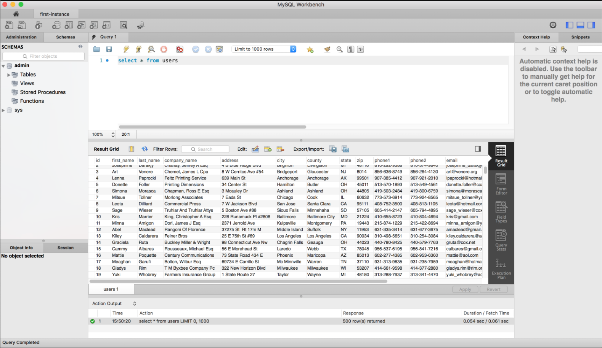

# Class 5: SELECT Practice

<!-- ! HIDE FROM STUDENT; INSTRUCTOR ONLY CONTENT -->
<!-- ## Instructor Only Content - HIDE FROM STUDENTS -->

<!-- ! END INSTRUCTOR ONLY CONTENT -->

*They can because they think they can. —Virgil*

## Greet, Outline, and Objectify

<!-- SMART: Specific, Measurable, Attainable, Relevant, and Timely. -->
<!-- https://examples.yourdictionary.com/well-written-examples-of-learning-objectives.html -->

Today we're going to:
  
*OBJECTIVE - Today the student will learn and practice to understand:*

* *Creating a database instance on Google Cloud*
* *Using MySQL Workbench to test and query their database*

*****

- [ ] Questions for Student Led Discussion
- [ ] Interview Challenge
- [ ] Student Presentations
- [ ] Creation Time
    * [ ] PART 1 - Account, Database, and Connect: Create Google Cloud Instance and Connect to MySQL Workbench (Do together as a class)
    * [ ] [Clone the Repo](https://github.com/AustinCodingAcademy/311_wk3_day1_db_select)
    * [ ] PART 2 - The Project: Practice Querying Data from the New Database (Do as small groups)
- [ ] Push Yourself Further
<!-- - [ ] Blog to Show You Know -->
- [ ] Exit Recap, Attendance, and Reminders

### Questions for Student Led Discussion, 15 mins
<!-- This section should be structured with the 5E model: https://lesley.edu/article/empowering-students-the-5e-model-explained -->

[Questions to prompt discussion](./../additionalResources/questionsForDiscussion/qfd-class-5.md)

### Interview Challenge, 15 mins
<!-- The last two E happen here: elaborate and evaluate  -->
<!-- this sections should have a challenge that can be solved with the skills they've learned since their last class. -->
<!-- ! HIDDEN CONTENT: INSTRUCTOR ONLY -->
[See Your Challenge Here](./../additionalResources/interviewChallenges.md)
<!-- ! END HIDDEN CONTENT: INSTRUCTOR ONLY -->

### Student Presentations, 15 mins

[See Student Presentations List](./../additionalResources/studentPresentations.md)

## Creation Time, 60-90 mins

Today we are going to set up our own database instance (which can hold many databases) on Google Cloud. We will continue to use this instance throughout the rest of this course. Once it's set up we will create a database and then import some data into a table called "users". We will then practice querying that data with SELECT statements. We will download a tool called [MySQL Workbench](https://www.mysql.com/products/workbench/) to help us do this.

### Part One: Account, Database, & Connect

#### Google Cloud

Google Cloud Platform (GCP) is one of the most popular and robust platforms for maintaining infrastructure (servers) in the cloud. It has an intuitive user interface and support for many open source projects including MySQL. It continues to gain ground on AWS as the de-facto IAAS (Infrastructure as a Service) platform, but developers certainly have their options. Other cloud platforms include AWS, Microsoft Azure, IBM Cloud, etc.

#### Pricing

Google Cloud has a free option for developers getting started with the platform. Upon registration, each account receives $300 in credit to use on computing resources as you learn. A credit card is required for registration but you will **not** be auto-renewed, bumped into a paid version or charged at all without your permission. See below:

#### Creating Your Account

- [ ] Navigate to: [Google Cloud](https://cloud.google.com/)
- [ ] Click "Get started for free" in the top right corner
- [ ] Complete the steps to create account
    * [ ] **Credit card required here**
    * [ ] *Credit card will not be charged*
- [ ] Upon successful registration you should see the main dashboard

#### Creating DB Instance

- [ ] Take a look at the navigation menu (top-left) on the dashboard. You should see a lot of options.
- [ ] Locate the heading that reads "STORAGE" and click the "SQL" option.
- [ ] Click "CREATE INSTANCE" near the top of the page.
- [ ] Select "MySQL" from the two options.
- [ ] Fill out the form with the following information
    * [ ] Instance ID: "first-instance"
    * [ ] Root password: a password of your choice
    * [ ] All other defaults can be left alone
- [ ] Click "Create" and wait for the instance to be set up. This can take a few minutes.
- [ ] When the instance is ready there will be a green checkmark next to it. Click on the name "first-instance" to see an overview.
- [ ] In this overview screen, look for a menu option called "DATABASES" and click it.
- [ ] Create a database called "admin".

We're almost done . . . we just need to allow the database instance to be accessed from outside of this console. To do that we need to whitelist our IP address.

- [ ] Navigate to the "CONNECTIONS" tab.
- [ ] Look for the checkbox by "Public IP", we need to add a network.
- [ ] Find your [IP address here](https://www.google.com/search?ei=Ds7_XODXFOOwtgW2o5OABA&q=what%27s+my+ip) and enter it into the dialog box with a name.
    * [ ] Note that you will need to do this for each network you want to access the database from (home, work, ACA, Starbucks, wherever . . .)
- [ ] Make sure to click the save button.
We're ready to go! We have a database set up in Google Cloud that can be accessed from anywhere. Now we need to learn how to interact with it in the next step.

#### Download MySQL Workbench

- [ ] Navigate to [MySQL Workbench download](https://www.mysql.com/products/workbench/)
- [ ] Click "Download Now"
- [ ] At the bottom of the page select your system specs (Mac, Windows)
- [ ] Click the "download" button again and then click "No thanks, just start my download" on the next page
- [ ] When the download completes, install MySQL Workbench
- [ ] Start MySQL Workbench.

=== "For Windows Users"

    <iframe width="560" height="315" src="https://www.youtube.com/embed/12j-tiRpXX4" title="YouTube video player" frameborder="0" allow="accelerometer; autoplay; clipboard-write; encrypted-media; gyroscope; picture-in-picture" allowfullscreen></iframe>

=== "For Older Mac Users"

    * download an early version of the workbench: 
        - [https://downloads.mysql.com/archives/workbench/](https://downloads.mysql.com/archives/workbench/)
    * and/or use this guide: 
        - [https://www.macminivault.com/install-mysql-on-macos-high-sierra/](https://www.macminivault.com/install-mysql-on-macos-high-sierra/)

#### Connect MySQL Workbench to the Database on GCP

- [ ] When opening MySQL Workbench, one of the first things you see is some text that says "MySQL Connections"
- [ ] Click the little plus sign next to that text. A dialog box should pop up
- [ ] Fill out the following information:
    * [ ] Connection Name: "first-instance"
    * [ ] Hostname: The IP address of your db in GCP
    * [ ] You can find this on the "OVERVIEW" tab
    * [ ] Password: Click "store in keychain" and enter the password you gave your instance when you set it up in the last step
    * [ ] Default Schema: We'll use the name of the database we created earlier, "admin"
- [ ] Click "Test Connection". It should have been successful
- [ ] Click "Ok" to save the connection
The new connection should be listed under "MySQL Connections", double click it to connect to the database

<!-- Just added aug16th -->
##NOTE:
When creating your first-instance you are using sensitive variables given to you by google to connect to the database you created. When we connect to our local server were going to use a file called `.env'. More on this soon. Just be aware the variables you use are secret.

We should have successfully created a database and connected to it. We've done a lot of setup so far but for our homework we'll add some data to our database and begin querying the data. Reference the following docs for additional information and walkthroughs of what we've covered so far.

#### Additional Resources

- [ ] [GCP Docs - Cloud SQL Quickstart](https://cloud.google.com/sql/docs/mysql/quickstart)
- [ ] [GCP Docs - MySQL Workbench](https://cloud.google.com/sql/docs/mysql/admin-tools#workbench)
- [ ] [GCP Docs - Connecting from external applications](https://cloud.google.com/sql/docs/mysql/connect-external-app)
- [ ] [Google Search - What's my IP](https://www.google.com/search?ei=Ds7_XODXFOOwtgW2o5OABA&q=what%27s+my+ip)
- [ ] [Article, Kaggle - SELECT WHERE](https://www.kaggle.com/dansbecker/select-from-where)

*****

### Part Two: Making a DB

- [ ] Make sure you follow the previous steps to configure Google Cloud and MySQL Workbench
- [ ] Fork and clone the following repository: [DB Select](https://github.com/AustinCodingAcademy/311_wk3_day1_db_select)
- [ ] Follow the `README.md` to enter data into your database and query it
- [ ] [YT, Caleb Curry - MySQL 24: How to use a WHERE Clause](https://youtu.be/AQNPyG9_b_c)

### Push Yourself Further

Read the following sections in this [MySQL Advanced Select tutorial](https://www.mysqltutorial.org/mysql-between) and try them out on the DBfiddle from our pre-work.

- [ ] `ORDER BY`
- [ ] `SELECT DISTINCT`
- [ ] `IN`
- [ ] `OR`
- [ ] `AND`
- [ ] `BETWEEN`
- [ ] `LIMIT`

## Student Feedback

<iframe src="https://docs.google.com/forms/d/e/1FAIpQLScjuL10i2xFGMWRwkjtgAL8F1Y5ipMPPjtTCDzkO1ZBcxUYZA/viewform?embedded=true" width="640" height="500" frameborder="0" marginheight="0" marginwidth="0">Loading…</iframe>

## Exit Recap, Attendance, and Reminders, 5 mins

- [ ] Prepare for next class by completing all of your pre-class lessons
- [ ] Complete the feedback survey

<!-- <iframe id="openedx-zollege" src="https://openedx.zollege.com/feedback" style="width: 100%; height: 500px; border: 0">Browser not compatible.</iframe>
 -->

<!-- TODO Create 3 question exit questions -->

<!-- TODO INSERT Student Feedback From -->

<!-- TODO INSERT *HIDDEN* Instructor Feedback Form -->
