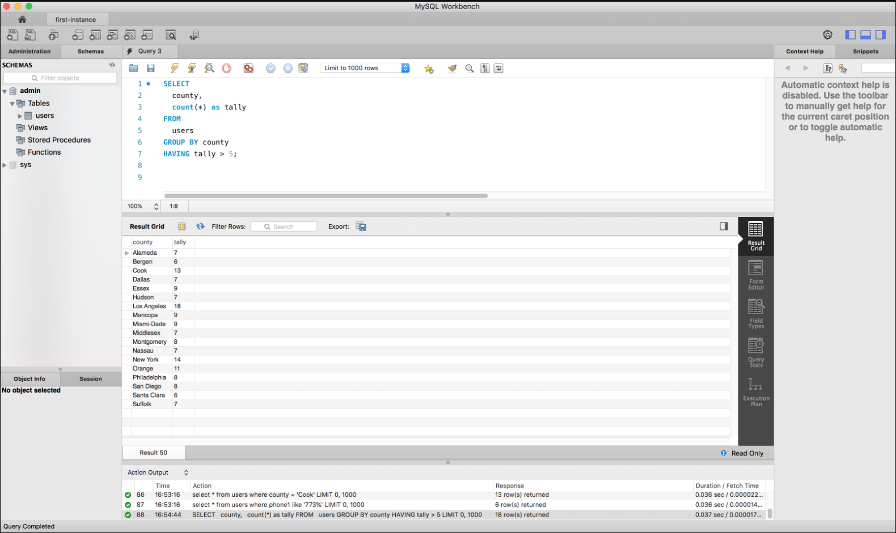
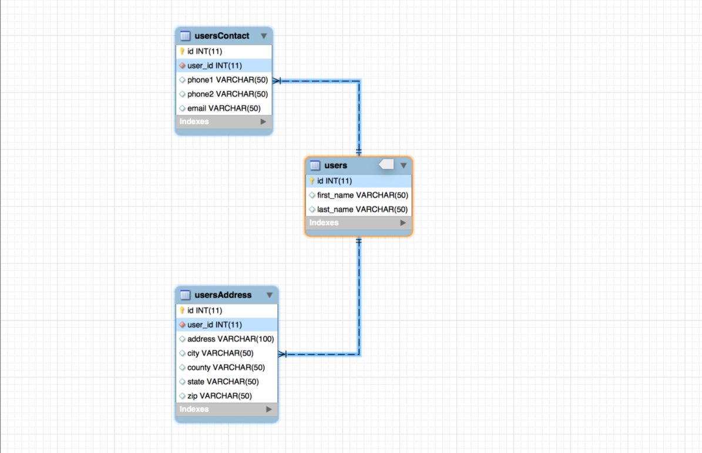

# Class 6: Advanced SELECT

<!-- ! HIDE FROM STUDENT; INSTRUCTOR ONLY CONTENT -->
<!-- ## Instructor Only Content - HIDE FROM STUDENTS -->

<!-- ! END INSTRUCTOR ONLY CONTENT -->

*We are all motivated by a keen desire for praise, and the better a man is, the more he is inspired to glory. —Cicero*

## Greet, Outline, and Objectify

<!-- SMART: Specific, Measurable, Attainable, Relevant, and Timely. -->
<!-- https://examples.yourdictionary.com/well-written-examples-of-learning-objectives.html -->

Today we're going to:
  
*OBJECTIVE - Today the student will learn and practice to understand:*

* *Advanced `SELECT` queries using multiple tables*
* *How to use `GROUP BY` & `HAVING`*

*****

- [ ] Questions for Student Led Discussion
- [ ] Interview Challenge
- [ ] Student Presentations
- [ ] Creation Time
    * [ ] Review `GROUP BY` & `HAVING`
    * [ ] [311-wk3-day2-advanced-select repo](https://github.com/AustinCodingAcademy/311_wk3_day2_advanced_select)
- [ ] Push Yourself Further
- [ ] Overview of Checkpoint 1: [Express CRUD Server](https://github.com/AustinCodingAcademy/311_checkpoint_1)
- [ ] Blog to Show You Know
- [ ] Exit Recap, Attendance, and Reminders

### Questions for Student Led Discussion, 15 mins
<!-- This section should be structured with the 5E model: https://lesley.edu/article/empowering-students-the-5e-model-explained -->

[Questions to prompt discussion](./../additionalResources/questionsForDiscussion/qfd-class-6.md)

### Interview Challenge, 15 mins
<!-- The last two E happen here: elaborate and evaluate  -->
<!-- this sections should have a challenge that can be solved with the skills they've learned since their last class. -->
<!-- ! HIDDEN CONTENT: INSTRUCTOR ONLY -->
[See Your Challenge Here](./../additionalResources/interviewChallenges.md)
<!-- ! END HIDDEN CONTENT: INSTRUCTOR ONLY -->

### Student Presentations, 15 mins

[See Student Presentations List](./../additionalResources/studentPresentations.md)

## Creation Time, 60-90 mins

Today we are going to do some advanced querying of our database. We are going to reconstruct our tables so that the "users" information is split into three tables and we will practice `JOIN`ing and `GROUP`ing data to fit our needs.

So far we've covered the `SELECT`, `FROM`, `WHERE` and `JOIN` command keywords, and most recently we've added `GROUP BY` and `HAVING` to our repertoire. Be sure to reference the lecture and the docs provided to complete today's project.

- [ ] Fork and clone the following repository: [Advanced Select](https://github.com/AustinCodingAcademy/311_wk3_day2_advanced_select)
- [ ] Follow the `README.md` to join tables, group by and generate an ER (Entity Relationship) diagram.
- [ ] [YT, O'Reilly Training - SQL Tutorial: Relational Databases Explained](https://youtu.be/h8IWmmxIyS0)

### Push Yourself Further

Follow the steps below to create an ER (Entity Relationship) diagram for your homework project. Assuming the homework was complete, you should have three tables: users, usersContact and usersAddress.

- [ ] Open MySQL Workbench.
- [ ] Ensure you are connected to your database.
- [ ] Test a query by running `SELECT * FROM users;`.
- [ ] In the MySQL Workbench menu, select Database -> Reverse Engineer.
- [ ] A dialog box should have appeared.
- [ ] In the first dropdown (stored connection), select the connection to your instance.
- [ ] Click "continue" three times until a list of databases appears. There should only be one ("admin").
- [ ] Select the "admin" database and continue accepting all other defaults.
- [ ] You should see your ER diagram displayed.
- [ ] Hover over the tables to see the relationships (usersContact and usersAddress point back to users).
- [ ] Click around the diagram and discover other information about your tables.

## Checkpoint 1: Express CRUD Server

So far we've recapped node/NPM, learned protocols, Axios, Express, routes and controllers, static files, status codes and had an intro to MySQL. We will use most of these technologies for this assignment.

* Express
* bodyParser
* Routes
* Controllers
* Use of static data (provided)
* GET/POST/PUT/DELETE
* Appropriate status codes

    > We will NOT be utilizing static files or MySQL.

### Checkpoint Objective

We are going to build an Express CRUD app using the knowledge we have of Express so far.

### Instructions

- [ ] Fork and clone the following repository: [Checkpoint 1](https://github.com/AustinCodingAcademy/311_checkpoint_1)
- [ ] Follow the README to create an Express CRUD app

## Blogs to Show You Know

[Blog Prompts](./../additionalResources/blogPrompts.md)

## Exit Recap, Attendance, and Reminders, 5 mins

- [ ] Create Advanced Select Assignment
- [ ] Create Checkpoint 1 Assignment
- [ ] Create Class 6 Blog To Show You Know Assignment
- [ ] Prepare for next class by completing all of your pre-class lessons
- [ ] Complete the feedback survey(if applicable)

<!-- <iframe id="openedx-zollege" src="https://openedx.zollege.com/feedback" style="width: 100%; height: 500px; border: 0">Browser not compatible.</iframe>
 -->

<!-- TODO Create 3 question exit questions -->

<!-- TODO INSERT Student Feedback From -->

<!-- TODO INSERT *HIDDEN* Instructor Feedback Form -->
