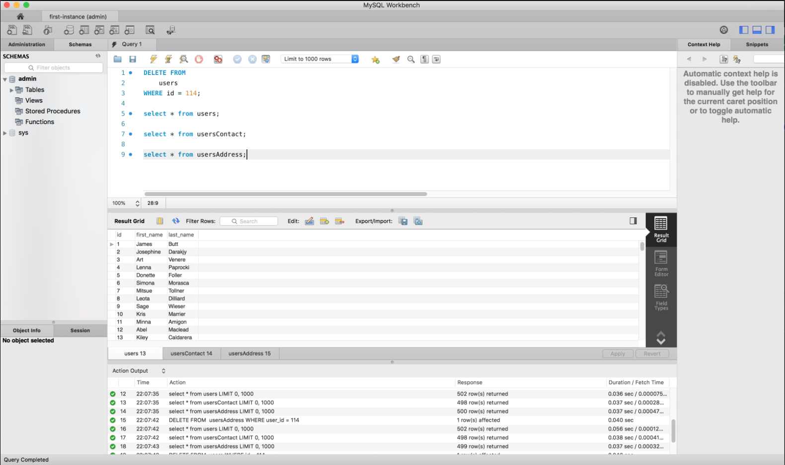
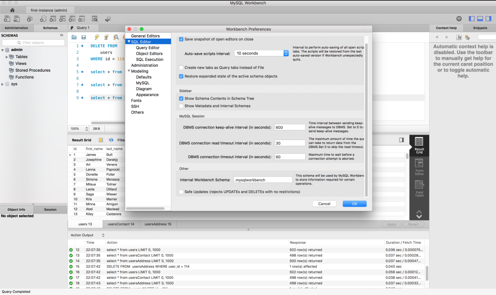

# Class 7: SQL CRUD

<!-- ! HIDE FROM STUDENT; INSTRUCTOR ONLY CONTENT -->
<!-- ## Instructor Only Content - HIDE FROM STUDENTS -->

<!-- ! END INSTRUCTOR ONLY CONTENT -->

*Nothing great was ever achieved without enthusiasm. —Ralph Waldo Emerson*

## Greet, Outline, and Objectify

<!-- SMART: Specific, Measurable, Attainable, Relevant, and Timely. -->
<!-- https://examples.yourdictionary.com/well-written-examples-of-learning-objectives.html -->

Today we're going to:
  
*OBJECTIVE - Today the student will learn and practice to understand:*

* *The remaining CRUD operations in SQL: Create, Update, and Delete*

*****

- [ ] Questions for Student Led Discussion
- [ ] Interview Challenge
- [ ] Student Presentations
- [ ] Creation Time
    * [ ] Fork and clone the [311_wk4_day1_crud Repo](https://github.com/AustinCodingAcademy/311_wk4_day1_crud)
    * [ ] Initialize your data
    * [ ] Create the 4 required statements to build a full CRUD SQL database.
- [ ] Push Yourself Further
- [ ] Exit Recap, Attendance, and Reminders

### Questions for Student Led Discussion, 15 mins
<!-- This section should be structured with the 5E model: https://lesley.edu/article/empowering-students-the-5e-model-explained -->

[Questions to prompt discussion](./../additionalResources/questionsForDiscussion/qfd-class-7.md)

### Interview Challenge, 15 mins
<!-- The last two E happen here: elaborate and evaluate  -->
<!-- this sections should have a challenge that can be solved with the skills they've learned since their last class. -->
<!-- ! HIDDEN CONTENT: INSTRUCTOR ONLY -->
[See Your Challenge Here](./../additionalResources/interviewChallenges.md)
<!-- ! END HIDDEN CONTENT: INSTRUCTOR ONLY -->

### Student Presentations, 15 mins

[See Student Presentations List](./../additionalResources/studentPresentations.md)

## Creation Time, 60-90 mins

Today we are going to work on the CRUD operations of our database. We will practice `INSERT`ing, `UPDATE`ing and `DELETE`ing records from our tables and use our existing knowledge of `SELECT` to help us verify the changes we made. After this lesson we should have everything we need to interact with SQL databases.

- [ ] Fork and clone the following repository: [SQL CRUD](https://github.com/AustinCodingAcademy/311_wk4_day1_crud)
- [ ] Follow the `README.md` to `INSERT`, `UPDATE` and `DELETE` records.
- [ ] [YT, the Bad Tutorials - SQL Tutorial 25: ORDER BY](https://youtu.be/6YGvqrwQ9d4)

    > NOTE: As mentioned before, we will often want to check to make sure the inserts, updates or deletes worked as expected, and we do that by running a `SELECT` query on the data to view it.
    > NOTE 2: One important clause that we haven't talked about yet is the `ORDER BY` [clause](https://www.w3schools.com/sql/sql_orderby.asp). It will help you order the data in your tables by a field or group of fields. For example, if you just inserted a record, you may want to perform a `SELECT` statement in descending "order by" `id` so that the newest record is at the top. The video above will explain this clause.

### Push Yourself Further

The following document covers `INSERT`s, `UPDATE`s and `DELETE`s as well as commands to create and drop tables and databases. Additionally, the `DISTINCT` [command](https://www.w3schools.com/sql/sql_distinct.asp) will give you an easy way to de-dupe result sets.

- [ ] Review the following document on [most popular sql commands](https://www.webhostface.com/blog/most-popular-mysql-commands/)
- [ ] Continue using the [MySQL Documentation](https://dev.mysql.com/doc/) to further your learning. You will need to continuously reference docs like this in order to know how to write your SQL statements. Additionally, Google searches like "MySQL find all records that start with A" can be helpful in pointing you to Stack Overflow articles on the appropriate topic. The key is knowing what to search for. Often it's easier than you think.

## Student Feedback

<iframe src="https://docs.google.com/forms/d/e/1FAIpQLSd85nNCk_MdnaXCsX7fWl3vYgcqvozzlK2cKq26d2g67Zh8Kg/viewform?embedded=true" width="640" height="600" frameborder="0" marginheight="0" marginwidth="0">Loading…</iframe>

## Exit Recap, Attendance, and Reminders, 5 mins

- [ ] Prepare for next class by completing all of your pre-class lessons
- [ ] Complete the feedback survey

<!-- <iframe id="openedx-zollege" src="https://openedx.zollege.com/feedback" style="width: 100%; height: 500px; border: 0">Browser not compatible.</iframe>
 -->

<!-- TODO Create 3 question exit questions -->

<!-- TODO INSERT Student Feedback From -->

<!-- TODO INSERT *HIDDEN* Instructor Feedback Form -->
