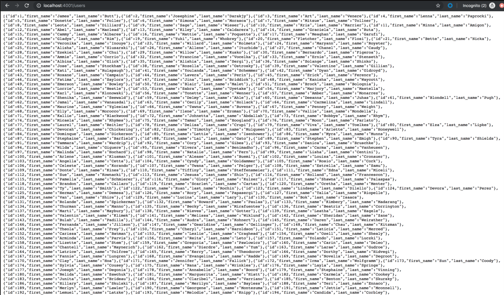
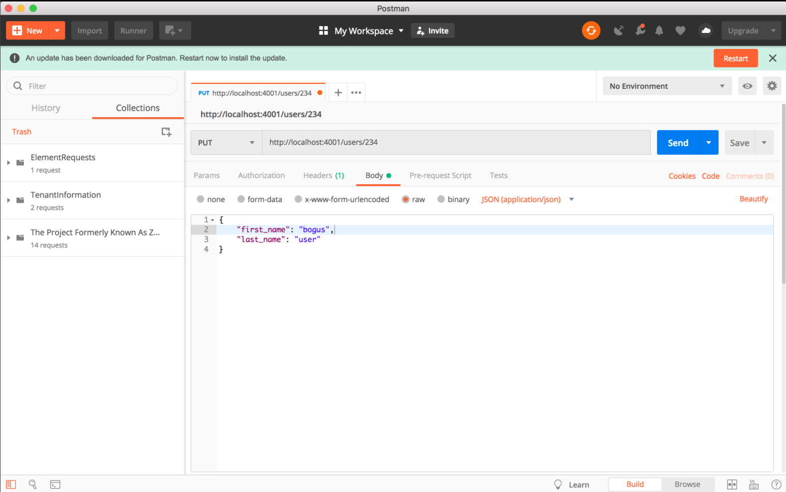

# Class 8: MySQL + Express

<!-- ! HIDE FROM STUDENT; INSTRUCTOR ONLY CONTENT -->
<!-- ## Instructor Only Content - HIDE FROM STUDENTS -->

<!-- ! END INSTRUCTOR ONLY CONTENT -->

*For hope is but the dream of those that wake. —Matthew Prior*

## Greet, Outline, and Objectify

<!-- SMART: Specific, Measurable, Attainable, Relevant, and Timely. -->
<!-- https://examples.yourdictionary.com/well-written-examples-of-learning-objectives.html -->

Today we're going to:
  
*OBJECTIVE - Today the student will learn and practice to understand:*

* *How to use NPM MySQL with Express to connect to an SQL database*

*****

- [ ] Questions for Student Led Discussion
- [ ] Interview Challenge
- [ ] Student Presentations
- [ ] Creation Time
    * [ ] Fork and clone the [311_wk4_day2_node_mysql Repo](https://github.com/AustinCodingAcademy/311_wk4_day2_node_mysql)
    * [ ] Complete the SQL database to Express app connection for a full CRUD API with SQL database
- [ ] Push Yourself Further
- [ ] Blog to Show You Know
- [ ] Exit Recap, Attendance, and Reminders

### Questions for Student Led Discussion, 15 mins
<!-- This section should be structured with the 5E model: https://lesley.edu/article/empowering-students-the-5e-model-explained -->

[Questions to prompt discussion](./../additionalResources/questionsForDiscussion/qfd-class-8.md)

### Interview Challenge, 15 mins
<!-- The last two E happen here: elaborate and evaluate  -->
<!-- this sections should have a challenge that can be solved with the skills they've learned since their last class. -->
<!-- ! HIDDEN CONTENT: INSTRUCTOR ONLY -->
[See Your Challenge Here](./../additionalResources/interviewChallenges.md)
<!-- ! END HIDDEN CONTENT: INSTRUCTOR ONLY -->

### Student Presentations, 15 mins

[See Student Presentations List](./../additionalResources/studentPresentations.md)

## Creation Time, 60-90 mins

Today we are going to work on the CRUD operations of our database again but this time all the operations will be in an Express app. After today we will have a fully functioning API attached to an SQL database. We still have a few more things to do in this course but at this point you should be proud because we've gotten through the meat of it! More best practices such as authentication to come . . .

In the example below we see how to parse this immense data into just what we need, dynamically.

- [ ] Fork and clone the following repository: [Node MySQL](https://github.com/AustinCodingAcademy/311_wk4_day2_node_mysql)
- [ ] Follow the `README` to `SELECT`, `INSERT`, `UPDATE` and `DELETE` records from an Express app
    
    > Here's a cool video about wrapping the callbacks from the connection pool in promises. More importantly, this video handles Express and MySQL from **start --> finish**!

- [ ] [YT, Covalence - MySQL, Node, Express Walk-Through](https://youtu.be/LVfH5FDOa3o)

### Push Yourself Further

There are a couple semi-advanced concepts in SQL that we haven't covered yet, but that's ok. The bulk of our time has been prioritizing the necessities. That being said, if you really want to take it to the next level (AND YOU SHOULD) you can spend some time on your own learning about `transactions` and `stored procedures`.

- [ ] [MySQL Docs - Transaction](https://www.tutorialspoint.com/mysql/mysql-transactions.htm)
- [ ] [Medium, Peter Lafferty - MySQL Stored Procedures 101](https://medium.com/@peter.lafferty/mysql-stored-procedures-101-6b4fe230967)
- [ ] [NPM MySQL Docs - Transactions](https://www.npmjs.com/package/mysql#transactions)
- [ ] [NPM MySQL Docs - Stored Procedures](https://www.npmjs.com/package/mysql#stored-procedures)

## Student Feedback

<iframe src="https://docs.google.com/forms/d/e/1FAIpQLScjuL10i2xFGMWRwkjtgAL8F1Y5ipMPPjtTCDzkO1ZBcxUYZA/viewform?embedded=true" width="640" height="500" frameborder="0" marginheight="0" marginwidth="0">Loading…</iframe>

## Blogs to Show You Know

[Blog Prompts](./../additionalResources/blogPrompts.md) 

## Exit Recap, Attendance, and Reminders, 5 mins

- [ ] Create MySQL+CRUD Assignment
- [ ] Create Class 8 Blog To Show You Know Assignment
- [ ] Prepare for next class by completing all of your pre-class lessons
- [ ] Complete the feedback survey

<!-- <iframe id="openedx-zollege" src="https://openedx.zollege.com/feedback" style="width: 100%; height: 500px; border: 0">Browser not compatible.</iframe>
 -->

<!-- TODO Create 3 question exit questions -->

<!-- TODO INSERT Student Feedback From -->

<!-- TODO INSERT *HIDDEN* Instructor Feedback Form -->
