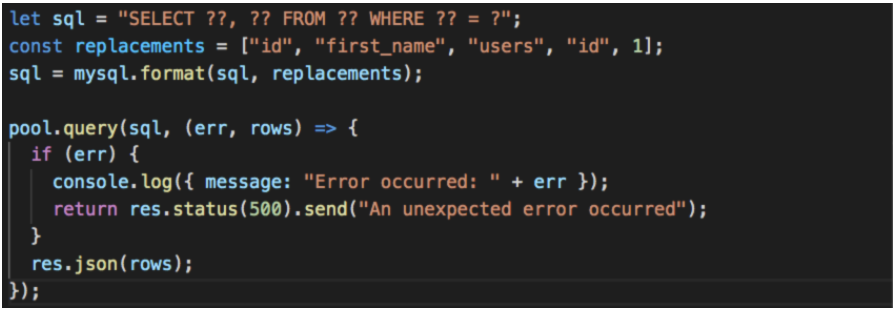

# Adding SQL Statements to an Express Server

*Constant dripping hollows out a stone. —Lucretius*

## Overview

Up to this point we've learned about two technologies: MySQL and Express, separately. Now it's time to put them both together. The APIs we create will need access to a database, and while running these statements in MySQL Workbench has helped us learn . . . it's time to move these SQL statements into our Express server so it can create, read, update, and delete data in our database.

There are two aspects we need to talk about when using MySQL in Express: connections and queries. We will talk about each concept independently.

## Connections

When we [connected to MySQL Workbench in a previous class](./mySql-WorkbenchSetup#connect-mysql-workbench), we were creating what's called a **single connection**. In a single connection, MySQL statements are executed in sequence, one after another. That means if we write two statements lik `UPDATE` etc, `SELECT` etc, the program will run the first and then the second. This is great when using MySQL Workbench but in the APIs we will be creating, people will be making requests too often & too quickly for a single connection to keep up with. Two hundred people might call `SELECT * FROM users` at nearly identical times but could experience drastically different wait times based on whether or not they were the first person or the 2,000th person. That is because the 2,000th person needs to wait for the `SELECT` statement to run 1,999 times before it executes for them. We solve this by using **connection pools**.

**Connection pools** are groups of single connections. We can specify any arbitrary number that represents how many concurrent connections our database instance can accept at any given time and our application will use those connections until it reaches the maximum number of allowed connections. For example, we may create a connection pool and give it a `connectionLimit` of `100`. Now in the previous example, if 2,000 people hit our API at the same exact time, nobody will have to wait for more than 20 SQL queries to be run because we can spread our 2,000 operations over 100 different connections. Here's an example of creating a connection pool with the [Node package: mysql](https://www.npmjs.com/package/mysql) in Express:

```javascript
  // create a variable to reference the `createPool` method on the `mysql` package and give it the following attributes

  const pool = mysql.createPool({
    connectionLimit: 100,
    host: 'localhost',  /*where to connect to the database*/
    user: 'root',  /* the user that has permission to access the database*/
    password: 'password', /*the credentials for that user*/
    database: 'admin' /*the database this connection should be made to*/
  })
```

  > NOTE: the values match the same values you gave to MySQL workbench to [make a connection in a previous class](./mySql-WorkbenchSetup#connect-mysql-workbench).

We will also create a **singleton** (object that can only be instantiated once) to return this connection pool to us so that we don't accidentally create multiple connection pools. In the code below you'll notice an `if(!this.pool)` statement, this is what's creating the **singleton object**.

  ```javascript
    // sql/connection.js file

    const mysql = require('mysql')

    class Connection {
      constructor() {
        if (!this.pool) {
          console.log('creating connection pool...')
          this.pool = mysql.createPool({
            connectionLimit: 100,
            host: 'localhost',
            user: 'root',
            password: 'password',
            database: 'admin'
          })

          return this.pool
        }

        return this.pool
      }
    }

    const instance = new Connection()

    module.exports = instance;
  ```
  
  > NOTE: It's asking, "does `this.pool` object already created? If so let's just return that object. If not let's create a new connection pool object."  

We'll see more on this in the homework assignment.

To use the **connection pool** *singleton* object we import it into any file that needs it like this:

```javascript
  const pool = require('./sql/connection');
```

### IMPORTANT: Storing Sensitive Information with `.env` & `.gitignore` Files

Note that we're and will be working with some sensitive data(the credentials to our live databases!!). When connecting to our DB with the express server (that will be stored in a repo of GitHub). We want to use a `.env` file, a place to put environment specific sensitive data. This is where we want to start putting *all of our sensitive data from now on*. This includes `host name`, `user`, `passwords`, `database names`, `API_keys`, and etc. It's very important to start using this file for security reasons to keep people we don't want to have access to our information away such as hackers or just anyone on the internet. The final step to safeguarding our sensitive information is to include our `.env` file in a `.gitignore` file so our git software will *ignore* the `.env` file and not push it up to the repo when we commit changes.

#### How to use `.env`

- [ ] First `cd` into the app you want to work, maybe the last server you built.
- [ ] Then run `npm install dotenv` to install the Node dotenv package
- [ ] Next run `touch .env .gitignore` to create two different files: `.env` & `.gitignore`
- [ ] Inside the `.env` file create the following YAML to store sensitive data.

```yaml
  PORT=3001
  API_KEY=thisIsMyApiKey
  HOST=localhost
  USER=root
  PASSWORD=ourpassword
  DATABASE=adminaccount
```

- [ ] Now go to the `.gitignore` file add the following to tell git not to include the sensitive information in commits.

```yaml
.env
```

- [ ] to use the information in the dotenv file you'll just import the file at the top of any file you need them like this: `require('dotenv').config()`

  > NOTE: `.config()` is a method that expose the values to that specific file.

- [ ] to use variables you'll write: `process.env.PASSWORD`.

  > NOTE: When you use this code it accesses the file and finds the variable by name.

 You can use a variable at the top of your file like this to allow for quick usage in your files.

```javascript
//import dotenv file
require('dotenv').config()

//store in a variable to use multiple times if needed
 const host = process.env.HOST
 const user = process.env.USER
 const password = process.env.PASSWORD
 const database = process.env.DATABASE
 
 //Create a connection
  class Connection {
  constructor() {
    if (!this.pool) {
      this.pool = mysql.createPool({
        connectionLimit: 100,
        //see how were using the variables stored above to now secure our credentials?
        host: host,
        user: user,
        password: password,
        database: database
        //The important part of this code is understanding how we use env variables. don't worry about the other code so much.
      })
      return this.pool
    }
    return this.pool
  }
}
```

#### The `.gitignore` File

The final piece to the puzzle with `.env` is to never commit the file to github. It's important to always keep these variables to yourself. Either un-track the file when pushing to GitHub or better yet use a `.gitignore` file. When using a `.gitignore` file this will always keep secure files from being pushed to GitHub without you having to manually untrack them.

- [ ] In your terminal type `touch .gitignore` in the top level of your repo
- [ ] To use this file simply write the name of the file(s) you want ignored.

```yaml
.env
```

Now the `.env` file will always be ignored and you can comfortably use sensitive variables in it.

The file can be used to ignore all sorts of files you don't want/need in your repo and should be used by Mac users to disregard `DS_Store` files! But both Windows and Mac users can create custom and secure `.gitignore` files using this [`.gitignore` file generator at Toptal](https://www.toptal.com/developers/gitignore) or use the links listed in [Additional Resources](#additional-resources) below.

*****

## Queries

Now that we have our connection pool set up, it's time to use it to query our database. A query is just a request to do something with the data; either read it, update it, delete it or create more of it. To do any of these we pass the appropriate MySQL command to the `.query` method on the `pool` object: `pool.query` as a String. Typically this will happen inside our controllers, like the following:

```javascript
  // aControllerFile.js

  pool.query('SELECT * FROM users', (err, rows) => {
    if (err) {
      console.log({ 'message': 'Error occurred: ' + err })
      return res.status(500).send('An unexpected error occurred')
    }
    res.json(rows)
  });
```

The above will bring back all of the rows from the `users` table.

  > One thing to note is that the MySQL NPM package doesn't currently (*as of Sept 2021*) make use of promises so the queries will be written as callbacks. In this example, if we see an error we are going to log it and then tell the user that something unexpected happened. Otherwise, we are going to return the rows from the dataset.

What if you want to specify specific fields to bring back or specify fields to limit the query using a `WHERE` clause? You can do that as well.

<!-- used before because the parser didn't recognize the ?? in the sql string...seems to work now. -->
<!--  -->

```javascript
  let sql = "SELECT ??, ?? FROM ?? WHERE ?? = ?";
  const replacements = ["id", "first_name", "users", "id", 1];
  sql = mysql.format(sql, replacement);

  pool.query(sql, (err, rows) => {
    if (err) {
      console.log({ message: "Error occurred: " + err });
      return res.status(500).send("An unexpected error occurred");
    }
    res.json(rows);
  })
```

What's happening on the first three lines? A few things, let's break them down:

1. We're creating a string and saving it to a variable called `sql`. We could name it anything we want, maybe `sqlString`...whatever.
    * Inside that string we use question marks (`??`) & (`?`) to act as "variables". These "variables" allow us to create dynamic queries, that is to say, "We don't know what all of our users will request and therefore we can't create controllers for each of their request so instead we'll program a few controllers to **dynamically** handle all of those requests."
    * When we build this string we're following the directions in the [NPM MySQL Docs](https://www.npmjs.com/package/mysql) which says field names and table names get double question marks (`??`) and values get a single question mark (`?`).
2. Then we create an array called `replacements` filled with the values of our query.

    > In this example they're statically placed but later you can create them dynamically based on the incoming request.
    > **The order is important.** Place the values in the order you want them appear in the string because after we pass them both through the `.format` method on the `mysql` object (line 3) that SQL statement will become:

    ```sql
      SELECT id, first_name FROM users WHERE id = 1
    ```

3. Then we're using the `.format` method to put the string and array together into a single string that we can then pass as a SQL command to the `.query` method on the `mysql` object.

You may be asking:

=== "Question 1: **"Why do we need to use this extra step? Couldn't we just write them in directly?"**"

    **Answer 1:** Yep, you could but you wouldn't be able to make it dynamically handle different types of requests.

=== "Question 2: **"But couldn't we use Template Literals to dynamically create a string for this instead?"**"

    **Answer 2:** That would seem like the logical solution BUT using Template Literals would expose your server to a **very really security threat** called [SQL Injection](https://www.w3schools.com/sql/sql_injection.asp) where a person could pass a truthy statement in at the end of the query and have all of your data returned to them!

=== "Question 3: **"So how does `mysql.format()` prevent that?"**"

    **Answer 3:** The logic of this methods checks and cleans out sql injections and won't allow anything in that doesn't fit the string.

=== "..................The Mo' You Know......................."

    <iframe src="https://giphy.com/embed/d2YVk2ZRuQuqvVlu" width="480" height="240" frameBorder="0" class="giphy-embed" allowFullScreen></iframe>

*****

We're basically giving the `.format` method a SQL statement with some variables and an array of values to replace them with.

It's important for you to understand the [Node library package named mysql](https://www.npmjs.com/package/mysql). It has methods you can use to our advantage. One of them is the one you just saw: `mysql.format()`. Be sure to bookmark the [NPM Package mysql Docs](https://www.npmjs.com/package/mysql) to keep them handy and check out the [Additional Resources](#additional-resources).

## Practice It

Follow along with this video to create your own Express Server with the Node MySQL package:

[Video, Emily Moses@ACA - Setting up an Express Server w/MySQL Package](https://drive.google.com/file/d/1GFDcn1FTLvkiRAkByNGZYsdPUv7xqC3g/view)

Be sure to have this completed by the time you come into class.

## Additional Resources

- [ ] [Tutorial, CodeForGeek - NodeJS & MySQL](https://codeforgeek.com/nodejs-mysql-tutorial/)
- [ ] [YT, Traversy Media - Using SQL in Express.js](https://youtu.be/EN6Dx22cPRI)
- [ ] [YT, Aman Karbanda - Node.js & SQL Connection Pool](https://youtu.be/_IyN5HNV7QE)
- [ ] [Generator, TOPTAL .gitignore File - For Mac Users](https://www.toptal.com/developers/gitignore/api/node,macos,vs,dotenv)
- [ ] [Generator, TOPTAL .gitignore File - For Windows Users](https://www.toptal.com/developers/gitignore/api/dotenv,windows,visualstudiocode,node)

## Know Your Docs

- [ ] [NPM MySQL Docs - Home](https://www.npmjs.com/package/mysql)

<!-- ! END OF VIDEO 101.1.3.1 - TITLE-->
<!-- ? Video Numbering and Title system: CourseNumber.ModuleNumber.LessonNumber.VideoNumber -->
<!-- * (VIDEO 101.2.4.3 - "CSS Selectors") === 101 Course, Module 2, Lesson 4, Video 3 - "CSS Selectors" -->

<!-- 

cp workspace/resources/templateFile.md docs/module- 

```javascript

```

| Method      | Description                          |
| ----------- | ------------------------------------ |
| `GET`       | Fetch resource                       |
| `PUT`       | Update resource |
| `DELETE`    | Delete resource |


    `line numbers`
:do you like 'em?


++slash++
https://facelessuser.github.io/pymdown-extensions/extensions/keys/

=== "Javascript"

    ```javascript
    ```

=== "Python"

  ```python
  ```

=== "Example"
    ```console
      .
    ```

=== "Instructions"
    ```markdown
      .
    ```

=== "Result"
    
-->