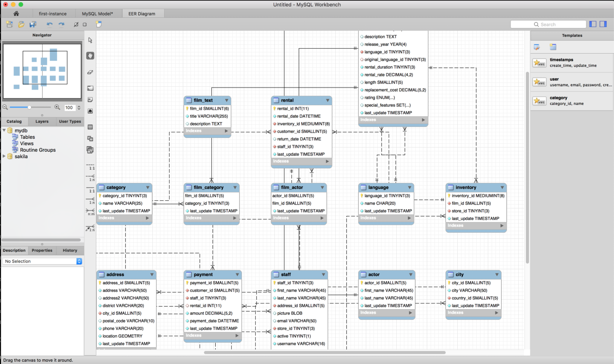

# Class 11: Data Modeling with ER Diagrams

<!-- ! HIDE FROM STUDENT; INSTRUCTOR ONLY CONTENT -->
<!-- ## Instructor Only Content - HIDE FROM STUDENTS -->

<!-- ! END INSTRUCTOR ONLY CONTENT -->

*Do not wait to strike till the iron is hot; but make it hot by striking. —William B. Sprague*

## Greet, Outline, and Objectify

<!-- SMART: Specific, Measurable, Attainable, Relevant, and Timely. -->
<!-- https://examples.yourdictionary.com/well-written-examples-of-learning-objectives.html -->

Today we're going to:
  
*OBJECTIVE - Today the student will learn and practice to understand:*

* *Using Google Cloud to create an instance of a database*
* *Configuring and importing data*
* *How to create a visual aid for data modeling, ER diagram*

*****

- [ ] Questions for Student Led Discussion
- [ ] Interview Challenge
- [ ] Student Presentations
- [ ] Creation Time
    * [ ] Fork and clone the [ER Diagrams Repo](https://github.com/AustinCodingAcademy/311_wk6_day1_er)
    * [ ] Configure and import data
    * [ ] Create an ER diagram
- [ ] Push Yourself Further
- [ ] Exit Recap, Attendance, and Reminders

### Questions for Student Led Discussion, 15 mins
<!-- This section should be structured with the 5E model: https://lesley.edu/article/empowering-students-the-5e-model-explained -->

[Questions to prompt discussion](./../additionalResources/questionsForDiscussion/qfd-class-11.md)

### Interview Challenge, 15 mins
<!-- The last two E happen here: elaborate and evaluate  -->
<!-- this sections should have a challenge that can be solved with the skills they've learned since their last class. -->
<!-- ! HIDDEN CONTENT: INSTRUCTOR ONLY -->
[See Your Challenge Here](./../additionalResources/interviewChallenges.md)
<!-- ! END HIDDEN CONTENT: INSTRUCTOR ONLY -->

### Student Presentations, 15 mins

[See Student Presentations List](./../additionalResources/studentPresentations.md)

## Creation Time, 60-90 mins

We should have followed the pre-work and gained a deeper understanding surrounding ER diagrams and how to read them. In today's class we will import a sample database from MySQL and create an ER diagram. We will then answer some questions about it in order to re-enforce our understanding.

- [ ] Fork and clone the following [repository: ER Diagrams](https://github.com/AustinCodingAcademy/311_wk6_day1_er)
- [ ] Follow the README to import data, create an ER diagram and answer questions about it
- [ ] [YT, Coding Passive Income - MySQL Triggers](https://youtu.be/NCEGs4RwAiM)

### Push Yourself Further

- [ ] Read [this article to understand database triggers](https://www.siteground.com/kb/mysql-triggers-use/).
- [ ] Follow along in MySQL Workbench to create the example described in the article

    > Note: triggers can be dangerous because they are basically "set and forget". Make sure your database is well documented

## Student Feedback

<iframe src="https://docs.google.com/forms/d/e/1FAIpQLScjuL10i2xFGMWRwkjtgAL8F1Y5ipMPPjtTCDzkO1ZBcxUYZA/viewform?embedded=true" width="640" height="500" frameborder="0" marginheight="0" marginwidth="0">Loading…</iframe>

## Exit Recap, Attendance, and Reminders, 5 mins

- [ ] Create ERD Assignment
- [ ] Prepare for next class by completing all of your pre-class lessons
- [ ] Complete the feedback survey

<!-- <iframe id="openedx-zollege" src="https://openedx.zollege.com/feedback" style="width: 100%; height: 500px; border: 0">Browser not compatible.</iframe>
 -->

<!-- TODO Create 3 question exit questions -->

<!-- TODO INSERT Student Feedback From -->

<!-- TODO INSERT *HIDDEN* Instructor Feedback Form -->
