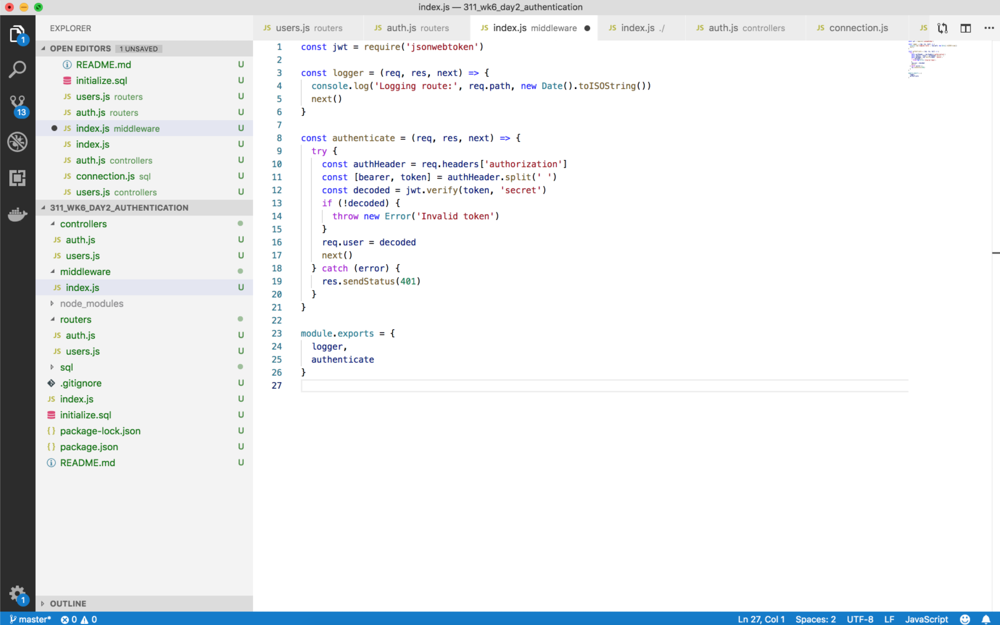
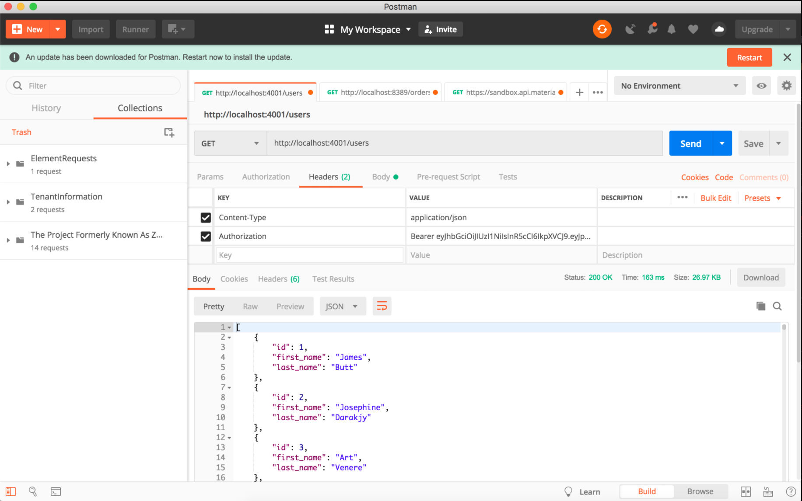

# Class 12: Authentication in Express

<!-- ! HIDE FROM STUDENT; INSTRUCTOR ONLY CONTENT -->
<!-- ## Instructor Only Content - HIDE FROM STUDENTS -->

<!-- ! END INSTRUCTOR ONLY CONTENT -->

*Fortune favors the brave. —Publius Terence*

## Greet, Outline, and Objectify

<!-- SMART: Specific, Measurable, Attainable, Relevant, and Timely. -->
<!-- https://examples.yourdictionary.com/well-written-examples-of-learning-objectives.html -->

Today we're going to:
  
*OBJECTIVE - Today the student will learn and practice to understand:*

* *JWT Authentication*
* *Logging in to a server*
* *Using Postman to test their authentication route*

*****

- [ ] Questions for Student Led Discussion
- [ ] Interview Challenge
- [ ] Student Presentations
- [ ] Creation Time
    * [ ] As a class make sure everyone has a Auth0 account and it is correctly setup
    * [ ] Study the example screenshots together
    * [ ] Fork and clone the [311_wk6_day2_authentication Repo](https://github.com/AustinCodingAcademy/311_wk6_day2_authentication)
    * [ ] Follow the instructions in the `README.md` file to create authentication routes
- [ ] Push Yourself Further
- [ ] Blog to Show You Know
- [ ] Exit Recap, Attendance, and Reminders

### Questions for Student Led Discussion, 15 mins
<!-- This section should be structured with the 5E model: https://lesley.edu/article/empowering-students-the-5e-model-explained -->

[Questions to prompt discussion](./../additionalResources/questionsForDiscussion/qfd-class-12.md)

### Interview Challenge, 15 mins
<!-- The last two E happen here: elaborate and evaluate  -->
<!-- this sections should have a challenge that can be solved with the skills they've learned since their last class. -->
<!-- ! HIDDEN CONTENT: INSTRUCTOR ONLY -->
[See Your Challenge Here](./../additionalResources/interviewChallenges.md)
<!-- ! END HIDDEN CONTENT: INSTRUCTOR ONLY -->

### Student Presentations, 15 mins

[See Student Presentations List](./../additionalResources/studentPresentations.md)

## Creation Time, 60-90 mins

Use these examples and the instructions in the `README.md` file of the [repo](https://github.com/AustinCodingAcademy/311_wk6_day2_authentication) to add authentication to the API.

- [ ] Fork and clone the following [repository: Express Authentication](https://github.com/AustinCodingAcademy/311_wk6_day2_authentication)
- [ ] Follow the `README` to create middleware for your routes
- [ ] [YT, SelfTuts - Middleware in Express](https://youtu.be/iBkOz9WLZRM)
<!-- ! Video Content:  (width="655" height="368", ratio 1.77) -->

### Push Yourself Further

- [ ] Read the [Express doc on configuring middleware](https://expressjs.com/en/guide/writing-middleware.html) for your applications

## Blogs to Show You Know

[Blog Prompts](./../additionalResources/blogPrompts.md)

## Exit Recap, Attendance, and Reminders, 5 mins

- [ ] Create Express Authentication Assignment
- [ ] Create Class 12 Blog To Show You Know Assignment
- [ ] Prepare for next class by completing all of your pre-class lessons
- [ ] Complete the feedback survey(if applicable)

<!-- <iframe id="openedx-zollege" src="https://openedx.zollege.com/feedback" style="width: 100%; height: 500px; border: 0">Browser not compatible.</iframe>
 -->

<!-- TODO Create 3 question exit questions -->

<!-- TODO INSERT Student Feedback From -->

<!-- TODO INSERT *HIDDEN* Instructor Feedback Form -->
