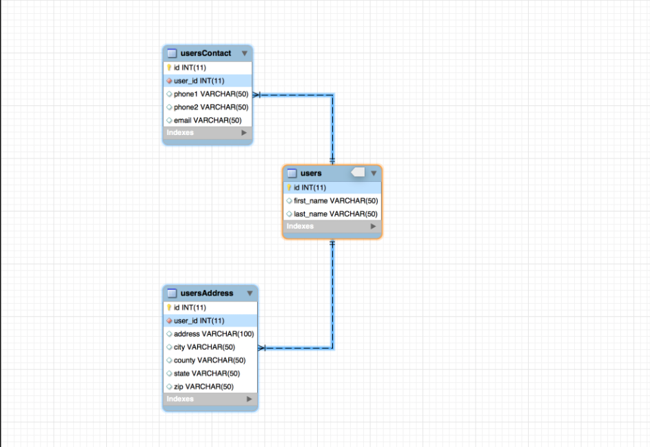
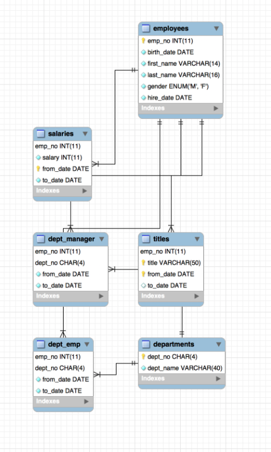
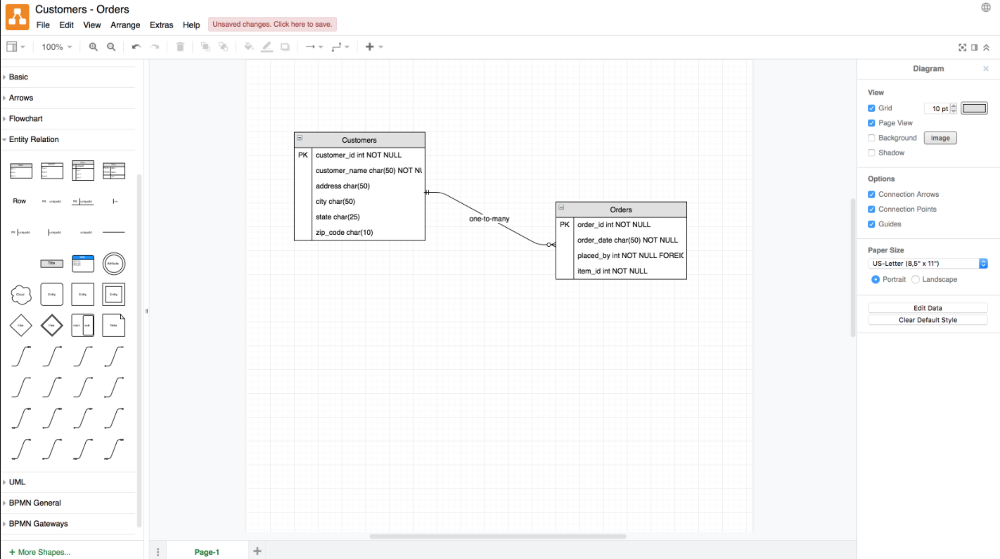

# Data Modeling with ER Diagrams

*Strong lives are motivated by dynamic purposes. —Kenneth Hildebrand*

## Overview

At this point we have most of the knowledge needed for creating APIs. We've practiced this numerous times and you should be getting familiar with the process. Now we're going to take a break and do a deeper dive into the **Entity Relationship Diagrams** (ERD) we first looked at last week.

## Why Use Data Modeling?

Data modeling is the process of creating a data model for the relationships in your database. The data model emphasizes what data is needed and how it should be organized in a visual manner. In a nutshell, we want to make sure all data objects are accurately represented well before we write any code!

One of the most common ways to do this is through the use of an **ERD** (Entity Relationship Diagram).

You may be thinking to yourself, "Awesome, but why would I do this?" Here's a couple reasons why to use a data model. Using data models are much easier than changing your real database. It's a lot easier to build a data map than writing SQL queries to change your database. Being able to quickly change, and see the changes in a data model will help keep your new database from becoming disorganized, or incorrect. When creating a database it's easier for you to review a data model than review a a database design. In most cases when you start working for a new company if you, show a database to your team lead it might be more challenging to explain than simply showing a data model to them. These data models help improve organization and communication with your team. 

When we use data models, a good way to visualize why we do this is by imagining a company entity that owns several dental schools. Three of the schools this company owns would be separate entity tables: Houston, Austin, Dallas. We would have a bunch of properties in our company entity called `employee_number`, `phone_number`, `address`, `phone_number2`, and `email`. Now since our employee number property never changes and will always represent a single employee we can use this property in our other tables. We can have the employee number in the company's table and then use it again in our austin table for example, to maximize efficiency. When creating our data models always be thinking about maximizing use of our properties and this is why were going to be creating our own models. Take the time to think about all the individual relationships each entity and property can have for our final project's. 

  > NOTE: `employee_number` is an example of a **primary key** (PK) and will follow strict rules to be considered a **PK**. It will never change and can only be assigned to one person. Since it follows these rules we can re-use this throughout our database.  
### Entity Relationship Model

An Entity Relationship Diagram uses **[UML Notation](https://www.tutorialspoint.com/uml/uml_basic_notations.htm)** to visualize the relationships between our tables. **UML** stands for **Unified Modeling Language** and it is basically the go-to for designing object-oriented systems.

Remember our ER diagram from Week 3 . . .

### Breaking Down the ER Diagram

In the diagram above, the rectangles with our **table** names on them `usersContact` are called **entities**. It's just an object that represents some sort of important data. The table, once saved in the database would accept and store multiple entities with these **fields**/properties on them.

  > NOTE: Remember, tables are made of rows and columns. In a SQL table, each entry (entity) is a row and each column is a property/field/attribute of the entity. 

Inside of the entity we see the **attributes** that correspond to our tables. Those are the **field**/column names and there may be symbols next to those fields. In fact, there is generally a symbol there that gives us some information about the field's responsibility. If it has a key icon, for example, that indicates that the field is the **primary key**. You can see a [list of other field icons here](https://stackoverflow.com/questions/10778561/what-do-the-mysql-workbench-column-icons-mean).

Here's another diagram to look at. Notice the icons on these tables.

### Cardinality

The last thing we need to talk about in order to understand our ER diagrams is **cardinality**. Cardinality refers to the type of relationships that we maintain between our entities. These types of relationships are how we can enforce data integrity throughout our database. For example, I can't assign a `userId` on a child table like usersContacts to an `id` that DOESN'T EXIST on the parent table users. But what cardinality is really talking about is the maximum or minimum number of relationships that can be maintained between two entities. For example, a `user` can have multiple `userContacts` but only one `usersAddress`.

These relationships are usually described as **"one-to-many"**, **"one-to-one"**, or **"many-to-many"**. The lines between the entities and the small notations at the end of them dictate these relationships.

## Relationships Explained

- [ ] One-to-One: This relationship can be summed up as one table to another table allowing only one connection each. Such as a User table having a one to one relationship for a drivers license table. The user can only have one drivers license so it would be applicable to use the one to one relationship.

- [ ] One-to-Many: An example of a One to many relationship would be a users table again with an orders table. The user can have as many orders as they want so using one to many would work perfectly.

- [ ] Many-to-One: The next relationship is many to one and this can be understood as the opposite of the previous. Now lets say we have a credit card table would be a many cards to a user table that would only have a single user.

- [ ] Many-to-Many: An example of this would be a professors table to a students table. The professor can have many students and the students can have many professors. 

  > *Source: [LucidCharts](https://www.lucidchart.com/pages/ER-diagram-symbols-and-meaning)*

Let's look at the data from the `employees` database above:  

- [ ] Follow the line between the `employees` table to the `salaries` table. Starting at the `employees` table we see a double hash mark, this means that the relationship an entity in the `employees` table can have **one and only one** relationship with what ever table its connected to on this line.
- [ ] at the other end of that line connected to the `salaries` table we see a trident and a hash mark. This means that each entity in this table can have one or many relationships with entities in the table it's connected to.
- [ ] Summary: Each employee can have one and only one salary. But a salary amount could be given to one or, even, all of the employees.
- [ ] Going further, looking at the `salaries` table we can see that there are `from_date` and `to_date` fields. So it looks like that table holds a history of each salary an employee has had over the course of some time.

Are we starting to understand how to read these? You can see more cardinality symbols on the [bottom of this page](https://www.lucidchart.com/pages/ER-diagram-symbols-and-meaning).

To further illustrate, take a look at the `departments` entity. Notice the double hash and trident lines? This shows that each `department` can have only one `title` but multiple `dept_emp` (department employees).

## Determining our Data Model

Most of the information above assumes you already have a working database, or at least a couple tables. We've talked about how to read/interpret our diagrams and in our homework assignment today we will work on creating an ER diagram, but let's take a second to talk about modeling the data that these diagrams come from.

  > NOTE: data modeling is a broad subject. We will discuss only what's most important for us at this level.

Let's now assume that we are starting completely from scratch. We do not have a database set up at this point but we know we are going to use MySQL. We will want to take the following actions:

1. **Understand the company's industry**
  We need to know what we are building. Having an understanding of our business model will help us determine what our entities will be.

1. **Identify our entities**
  What tables do we think we will need to create? If I am in the eCommerce space I will probably want a table called `customers`.

1. **Identify our attributes**
  Now that we have our tables it's time to determine what fields should exist on those tables. Every "customer" should definitely have an `id`, but what else? We might want to know the customers' first and last names and probably some contact information.

1. **Identify our relationships**
  We have a "customers" table and because we know that customers will place orders, we've also gone ahead and created an "orders" table. Each table has its own set of attributes but how are they related? What's the cardinality? Well . . . if we assume that any customer can have multiple orders (that would make sense, right?) then we know that we have established a "one-to-many" relationship.

This is the thought process you will go through as you develop MySQL databases on your own. It may seem simple or it may seem complicated but data modeling is an important part of the development process and a good skill to have. Always begin by drawing it out on paper so you have a good visual understanding of your database's needs.

## Practice It

- [ ] Re-create the above diagram on [Draw.io](https://www.draw.io/)
- [ ] Find the elements you need under the "Entity Relation" tab on the left toolbar
  
  > Hint: You can use an SQL statement to have the app automatically create the entities (tables) for you . . .

## Additional Resources

- [ ] [YT, LucidChart - ERD Tutorial pt. 2](https://youtu.be/-CuY5ADwn24)
- [ ] [Article, TutorialsPoint - UML Notation](https://www.tutorialspoint.com/uml/uml_basic_notations.htm)
<!-- - [ ] [YT, tuber - title]() -->

## Know Your Docs

- [ ] [LucidChart Docs - ER Diagrams](https://www.lucidchart.com/pages/er-diagrams)
- [ ] [LucidChart - ERD Symbols](https://www.lucidchart.com/pages/ER-diagram-symbols-and-meaning)
- [ ] [Forum, StackOverflow - Column Icon Meanings](https://stackoverflow.com/questions/10778561/what-do-the-mysql-workbench-column-icons-mean)
