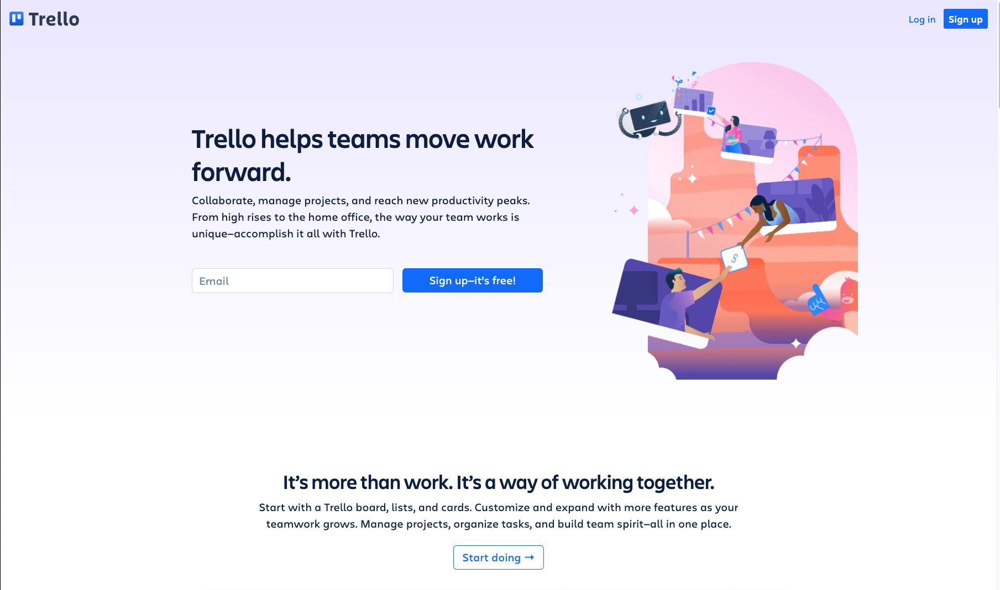
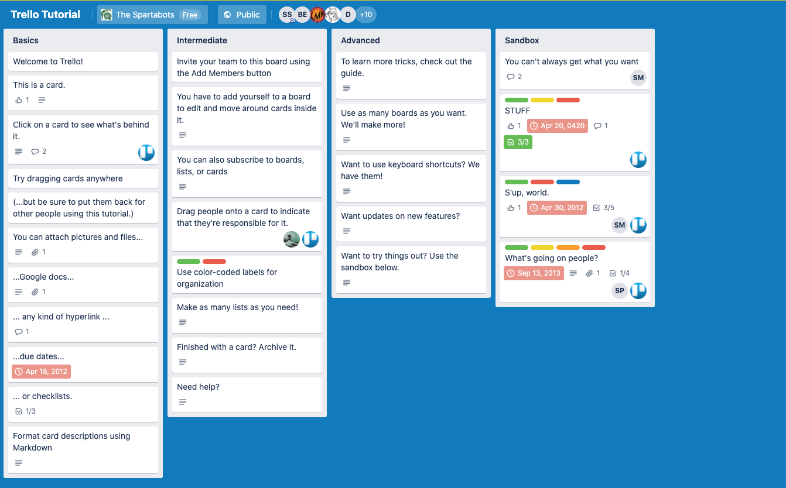

# TITLE

*Knowing is not enough; we must apply. Willing is not enough; we must do. —Johann Wolfgang von Goethe*

## Overview

At this point in the course we've recapped Node and NPM, worked with Express to set up a server with routes and controllers and spent some days learning the ins and outs of SQL. With this information we have the knowledge to build out most of an API, so this week we will work collaboratively on doing just that.

## Professional Team & Agile

This week we will work as a team to create a robust API from start to finish. To do that we need to know a little bit about how professional teams work together. This knowledge will be incredibly useful for you as you enter the workplace. First an overview of Agile.

### Agile

Agile is a process by where teams work in small cycles called sprints. These sprints usually last either one or two weeks and are designed to provide short feedback loops. In these feedback loops / sprints, teams gather requirements, create designs and begin coding a prototype or MVP (minimum viable product). Teams will then iterate on these ideas until a larger project goal is accomplished. During these sprints a number of things take place. These are more or less the [*rituals* of scrum](https://www.scrum.org/resources/what-is-scrum).

### Sprint Backlog Meeting

In this meeting, the team gets together during the sprint to groom the work for the next sprint. This means flushing out the work to be done and getting any additional details (technological or otherwise) that haven't been provided. These backlog meetings are typically a week before the next sprint and they help move things along so that when it's time to come to the next meeting, sprint planning, everyone is already familiar with some of the tasks to be accomplished.

### Sprint Planning Meeting

This is a meeting where the team discusses the amount of work they reasonably believe they can accomplish in the sprint. Tasks are broken out into individually releasable components that an individual developer can work on. Breaking it down into bite size pieces, as it were.

### Daily Standup Meeting

Every day during the sprint the team gets together in a designated space and talks about the progress that is being made. These meetings are typically held standing up, hence the name "standup". The intention here is to keep the meetings short and to the point so that everyone can get back to work quickly. Everyone goes around the circle and answers three questions:

* What did you accomplish yesterday?
* What are you working on today?
* Are there any blockers the team should know about?

### Sprint Review/Demo Meeting

This is where the team gets to show off the work that was accomplished during the sprint. Typically key stakeholders attend these demos. What are stakeholders? These are the people with a high amount of interest in the project. They will usually be product managers, executives or other forms of middle to senior management.

### Sprint Retrospective Meeting

The retro meeting is meant to be an opportunity to look back on the sprint and decide how well things were laid out. Did the sprint go smoothly? Did we accomplish more or less than we initially planned? Why? Did any unforeseen events take place that blocked the team for an extended period of time?

You should [read more about Agile here](https://www.mountaingoatsoftware.com/agile/scrum/resources/overview).

## Team Organization

Everything we've mentioned above has been designed to streamline development to the best of our ability, but how does it all get organized? How is the project managed?

We use ticketing systems like [Trello](https://trello.com/en-US) and [JIRA](https://www.atlassian.com/software/jira). These tools help us keep track of issues in a [Kanban board](https://en.wikipedia.org/wiki/Kanban_board) so that developers can see exactly who's working on what. The boards have different sections for the state of work that the task is in. For example, **To Do**, **In Progress**, **PR**, **QA**, **Done**. For the next week we will be using Trello to practice our use of a [Kanban board](https://en.wikipedia.org/wiki/Kanban_board) to track our tickets.

### Using Trello to Organize Tasks

[Trello](https://trello.com/) is a free software owned by Atlassian for doing exactly what was described above. The system is free but we will have to create a login for it. A board will be initially setup by ACA and the class will collaborate on it until the API is complete.

We'll use this board to breakdown large ideas and concepts into smaller accomplishable tasks, then into tiny steps that will build that bridge from point-A to point-B. Let's introduce [Trello](https://trello.com/), a free software owned by Atlassian for doing exactly what was described above by creating tiny draggable steps to keep you organized!

With [Trello](https://trello.com/) we can create **Swim Lanes**. This is **AGILE** jargon for columns that represent the status of a task, i.e. inbox, doing, done, etc.

Where,

**Inbox** would mean a place team members could add things to be done.
**Doing**, since your whole team works on one board, this show what tasks are being worked on and by who.
**Done**, beyond the obvious here, it's also a place that could signal a team lead/code reviewer to review your latest Pull Request.
**Archived**, after your teams has finished a code sprint you'll still want access to tasks that have been completed, when, and by who.
**Icebox**, kept for a later date, this category is reserved for tasks that seem a little too extra or your team doesn't have bandwidth for right now. This is a good place to keep up with stretch goals.
You should begin building your team board with these swim lanes or something very similar since this is what most companies practice.

## Practice It

This new tool, Trello, is just to help you get & stay organized and help you communicate between each other. So get to learning about this new tool:

Accounts are free but do require a sign-up. So let's get an account and a board created today!

- [ ] Navigate to the [trello tutorial](https://trello.com/b/I7TjiplA/trello-tutorial)
- [ ] Click around on the cards and start to get familiar with this tool.
- [ ] Go answer your **Questions for Student Discussion** while you're here.
- [ ] Now click "Sign-up", create an account.
- [ ] Create a new board and set it up the way you've learned so far.
- [ ] Look ahead at the hackathon and start draft large tasks for you and your teammates.

## Additional Resources

- [ ] [Article, Mountain Goat Software - Agile Overview](https://www.mountaingoatsoftware.com/agile/scrum/resources/overview)
- [ ] [YT, Simpletivity - 7 Things You Should Do with Every Trello Board](https://youtu.be/HvkTamEjDXk)

## Know Your Docs

- [ ] [Trello Docs - Keyboard Shortcuts](https://trello.com/shortcuts)
- [ ] [Trello Docs - How to Use Trello Like a Pro](https://help.trello.com/article/734-how-to-use-trello-like-a-pro)

