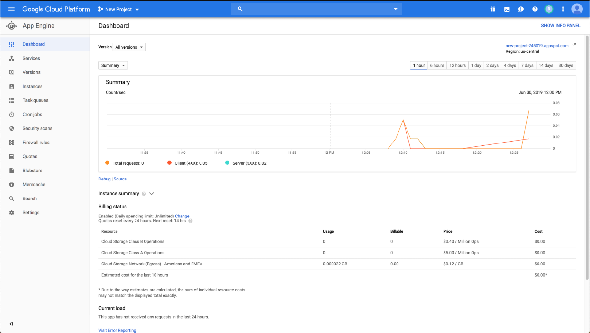

# Class 13: Hosting with App Engine

<!-- ! HIDE FROM STUDENT; INSTRUCTOR ONLY CONTENT -->
<!-- ## Instructor Only Content - HIDE FROM STUDENTS -->
<!-- cp workspace/resources/classOutlineTemplate.md docs/module- -->

<!-- ! END INSTRUCTOR ONLY CONTENT -->

*You cannot plough a field by turning it over in your mind. —Author Unknown*

## Greet, Outline, and Objectify

<!-- SMART: Specific, Measurable, Attainable, Relevant, and Timely. -->
<!-- https://examples.yourdictionary.com/well-written-examples-of-learning-objectives.html -->

Today we're going to:
  
*OBJECTIVE -Today the student will learn and practice to understand:*

* *Deploying an API and database to the cloud via App Engine*

*****

- [ ] Questions for Student Led Discussion
- [ ] Interview Challenge
- [ ] Student Presentations
- [ ] Creation Time
    * [ ] Fork and clone the [311_wk7_day1_deployment Repo](https://github.com/AustinCodingAcademy/311_wk7_day1_deployment)
    * [ ] Familiarize with the codebase
    * [ ] Deploy to the cloud.
    * [ ] Turn in "1stAppEngineURL"
- [ ] Push Yourself Further
<!-- - [ ] Blog to Show You Know -->
- [ ] Exit Recap, Attendance, and Reminders

### Questions for Student Led Discussion, 15 mins
<!-- This section should be structured with the 5E model: https://lesley.edu/article/empowering-students-the-5e-model-explained -->

[Questions to prompt discussion](./../additionalResources/questionsForDiscussion/qfd-class-13.md)

### Interview Challenge, 15 mins
<!-- The last two E happen here: elaborate and evaluate  -->
<!-- this sections should have a challenge that can be solved with the skills they've learned since their last class. -->
<!-- ! HIDDEN CONTENT: INSTRUCTOR ONLY -->
[See Your Challenge Here](./../additionalResources/interviewChallenges.md)
<!-- ! END HIDDEN CONTENT: INSTRUCTOR ONLY -->

### Student Presentations, 15 mins

[See Student Presentations List](./../additionalResources/studentPresentations.md)

## Creation Time, 60-90 mins

We're going to follow the instructions in the README.md to deploy our application and then test the hosted application. Additionally, here is a ["Hello World" example](https://cloud.google.com/nodejs/getting-started/hello-world) of deploying to App Engine from Google's docs.

At the end of this class our API will be hosted and accessible via a public facing URL.
=== "the Gif"

    
<iframe src="https://giphy.com/embed/3o7buiQeyYFamzRoR2" width="100%" height="100%" style="position:absolute" frameBorder="0" class="giphy-embed" allowFullScreen></iframe>

<a href="https://giphy.com/gifs/filmeditor-movie-comedy-3o7buiQeyYFamzRoR2">via GIPHY</a>

=== "the Dashboard"

    

*****

- [ ] Fork and clone the following [repository: App Engine Deployment](https://github.com/AustinCodingAcademy/311_wk7_day1_deployment)
- [ ] Follow the `README` to deploy your API
- [ ] [YT, Chris Parsons - Google Cloud Platform with Node.js](https://youtu.be/n4svrNcAkJg)

### Push Yourself Further

Attempt to replicate the steps in this lesson for a different project, maybe your graduation project . . . or try to find an older API we've created that doesn't use MySQL to make things easier.

- [ ] Navigate to a different project
- [ ] Ensure an `app.yaml` file exists
- [ ] Run `gcloud app deploy`
- [ ] Ensure the app is running as we expect

    > Note: Only one application can be hosted on App Engine at a time so this will overwrite the current homework assignment...FYI

## Student Feedback

<iframe src="https://docs.google.com/forms/d/e/1FAIpQLScjuL10i2xFGMWRwkjtgAL8F1Y5ipMPPjtTCDzkO1ZBcxUYZA/viewform?embedded=true" width="640" height="500" frameborder="0" marginheight="0" marginwidth="0">Loading…</iframe>

## Exit Recap, Attendance, and Reminders, 5 mins

- [ ] Create 1stAppEngineURL Assignment
- [ ] Prepare for next class by completing all of your pre-class lessons
- [ ] Complete the feedback survey

<!-- <iframe id="openedx-zollege" src="https://openedx.zollege.com/feedback" style="width: 100%; height: 500px; border: 0">Browser not compatible.</iframe>
 -->

<!-- TODO Create 3 question exit questions -->

<!-- TODO INSERT Student Feedback From -->

<!-- TODO INSERT *HIDDEN* Instructor Feedback Form -->
