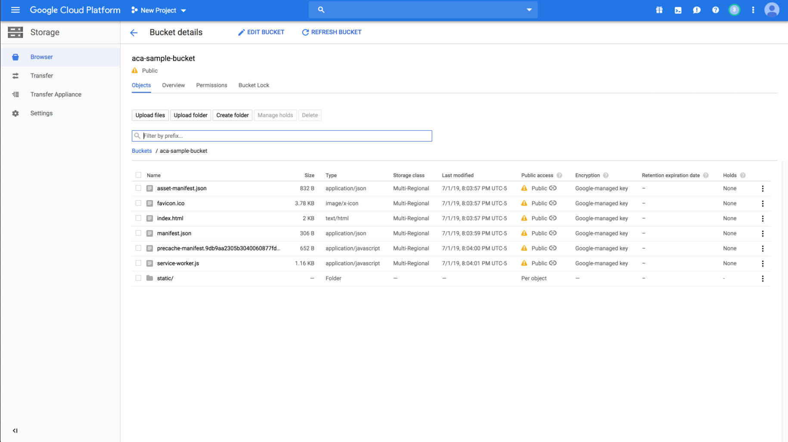

# Class 14: Hosting with Cloud Storage

<!-- ! HIDE FROM STUDENT; INSTRUCTOR ONLY CONTENT -->
<!-- ## Instructor Only Content - HIDE FROM STUDENTS -->
<!-- cp workspace/resources/classOutlineTemplate.md docs/module- -->

<!-- ! END INSTRUCTOR ONLY CONTENT -->

*Men's best successes come after their disappointments. —Henry Ward Beecher*

## Greet, Outline, and Objectify

<!-- SMART: Specific, Measurable, Attainable, Relevant, and Timely. -->
<!-- https://examples.yourdictionary.com/well-written-examples-of-learning-objectives.html -->

Today we're going to:
  
*OBJECTIVE - Today the student will learn and practice to understand:*

* *The use of cloud storage as it pertains to websites and web apps*

*****

- [ ] Questions for Student Led Discussion
- [ ] Interview Challenge
- [ ] Student Presentations
- [ ] Creation Time
    * [ ] Create new react app and build for production
    * [ ] Create Google Cloud bucket
    * [ ] Upload React app to bucket
    * [ ] Set bucket permissions
    * [ ] Turn in " 1st-React-App " url
- [ ] Push Yourself Further
- [ ] Blog to Show You Know
- [ ] Exit Recap, Attendance, and Reminders

### Questions for Student Led Discussion, 15 mins
<!-- This section should be structured with the 5E model: https://lesley.edu/article/empowering-students-the-5e-model-explained -->

[Questions to prompt discussion](./../additionalResources/questionsForDiscussion/qfd-class-14.md)

### Interview Challenge, 15 mins
<!-- The last two E happen here: elaborate and evaluate  -->
<!-- this sections should have a challenge that can be solved with the skills they've learned since their last class. -->
<!-- ! HIDDEN CONTENT: INSTRUCTOR ONLY -->
[See Your Challenge Here](./../additionalResources/interviewChallenges.md)
<!-- ! END HIDDEN CONTENT: INSTRUCTOR ONLY -->

### Student Presentations, 15 mins

[See Student Presentations List](./../additionalResources/studentPresentations.md)

## Creation Time, 60-90 mins

We will follow the instructions below to create a new project with create-react-app and host the project in Cloud Storage. Additional documentation is provided below.

- [ ] [GCP Docs - Creating a bucket](https://cloud.google.com/storage/docs/hosting-static-website#create-bucket)
- [ ] [GCP Docs - Uploading files](https://cloud.google.com/storage/docs/hosting-static-website#uploading_your_sites_files)
- [ ] [GCP Docs - Hosting static sites](https://cloud.google.com/storage/docs/hosting-static-website)



1. **(If Necessary) Install create-react-app**: `npm i -g create-react-app`

2. **Create the App with React**
    * [ ] Create a new project with your last name and the word "app" (ex. smith-app)
        * [ ] in the appropriate folder, i.e. `jsdev`, run `create-react-app smith-app`
    * [ ] `cd smith-app`
    * [ ] Use `npm start` to verify the project is working as expected

3. **Create a production build version**
    * [ ] Inside of your project, add the following to your `package.json` file: `"homepage": "./"`
    
    > You can do this right after the closing curly brace for `"browserslist"`. Make sure you add a comma after the curly-brace and before your `"homepage"` property.

    ```json
        <!-- more code here -->
            },

            "browserslist": {

                "production": [

                    ">0.2%",

                    "not dead",

                    "not op_mini all"

                ],

                "development": [

                    "last 1 chrome version",

                    "last 1 firefox version",

                    "last 1 safari version"

                ]

            },

            "homepage": "./"

        }
    ```

    > We are doing this because create-react-app made some assumptions about where you are serving the app from. We don't need to worry about this here.

    - [ ] Go to `./public/robots.txt` and update the text to say:

        ```markdown

            # https://www.robotstxt.org/robotstxt.html

            User-agent: *

            Allow: /
        ```
        
    - [ ] Run `npm run build` to create the files we need for production. They will live under the "build" folder.

4. **Creating a bucket**

    - [ ] Open your Google Cloud console in your browser
    - [ ] Under the main Google Cloud navigation select "Storage" under the heading "Storage" (redundant)
    - [ ] Click "Create Bucket"
    - [ ] Give your bucket a name. Keep in mind that this name must be unique across ALL of Cloud Storage so that means if anyone else has chosen your name first, you're out of luck. For our purposes let's try to call it the same thing as our create-react-app,  so -app (ex. "smith-app"). If this is taken, add some random numbers/letters.
    - [ ] Leave all other default options

5. **Uploading files**

    There are multiple ways to upload files to Cloud Storage. The two main ways are through the console with the "upload" button or with `gsutil`. Gsutils was downloaded when we downloaded the gcloud command-line utilities. Since we have already used the command line tools we are going to continue with that.

    - [ ] Use the `gsutil` tool to upload all files in the "build" folder to your bucket

        * [ ] If you are in the root project folder the command is: `gsutil cp -R build/* gs://smith-app`
        
        > NOTE: "-R" means recursively copy all items and "smith" is a sample last name

    - [ ] You should see progress happening in your terminal and a "completed" message when it is done
    - [ ] Refresh the page in the Google Cloud console to see your files in the bucket

6. **Bucket Permissions**

    In order to let people view our site we need to update our permissions and make the bucket public.

    In the console, select the "permissions" tab on your - [ ] bucket
    - [ ] Click "add members". You should see a side-panel open
    - [ ] Start typing "allUsers". You should see an option for this in the dropdown
    - [ ] Under "select a role" navigate down to storage and click "Storage Object Viewer"
    - [ ] Click "Save".
    - [ ] Repeat this process but this time choose the "Storage Legacy Bucket Reader" role.
    - [ ] Click "Save" Your bucket now has public permissions.

7. **View the site**

    You can view your app at: `https://storage.googleapis.com/<BUCKET NAME>/index.html`

    If all went according to plan we now have the basic `create-react-app` running in the cloud.

    > A quick note about this setup . . . this is not actually configured to serve traffic just yet. Notice how we had to navigate to the "index.html" file? Our users shouldn't have to do that. We just want to note that in order to set your site up to avoid that we need to edit the website configuration and you can only do that if you have a custom domain as described here. Domains are typically pretty cheap. We'd encourage you to buy a cheap domain from [https://domains.google.com/registrar](domains.google.com) and create another bucket with your domain name (www.example.com) in order to truly have a site running in GCS (Google Cloud Storage).

8. **Follow-Up Video**

    - [ ] [YT, StuffedBox - Host a Static Website on GCP](https://youtu.be/Jw60rw4p2lk)
 
### Push Yourself Further

- [ ] Purchase a domain name from [domains.google.com](https://domains.google.com/registrar) (or any other web hosting provider)
- [ ] Create a bucket with the name of that domain (www.example.com)
- [ ] Upload a basic create-react-app site
- [ ] Edit permissions to make the bucket public
- [ ] "Edit website configuration" to set the main (index) page and the 404 page
- [ ] Add a CNAME to your DNS configuration (godaddy) to point to the GCS
    * [ ] [Creating a CNAME](https://cloud.google.com/storage/docs/hosting-static-website#cname)
- [ ] View your live website

## Blogs to Show You Know

[Blog Prompts](./../additionalResources/blogPrompts.md)

## Exit Recap, Attendance, and Reminders, 5 mins

- [ ] Create 1st-React-App Assignment
- [ ] Create Class 14 Blog To Show You Know Assignment
- [ ] Prepare for next class by completing all of your pre-class lessons
- [ ] Complete the feedback survey(if applicable)

<!-- <iframe id="openedx-zollege" src="https://openedx.zollege.com/feedback" style="width: 100%; height: 500px; border: 0">Browser not compatible.</iframe>
<script src="https://openedx.zollege.com/assets/index.js" type="application/javascript"></script> -->

<!-- TODO Create 3 question exit questions -->

<!-- TODO INSERT Student Feedback From -->

<!-- TODO INSERT *HIDDEN* Instructor Feedback Form -->
