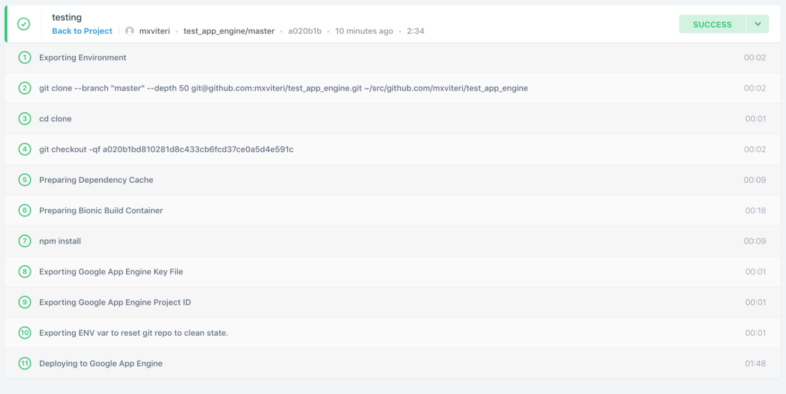

# Class 15: CloudBees CodeShip

<!-- ! HIDE FROM STUDENT; INSTRUCTOR ONLY CONTENT -->
<!-- ## Instructor Only Content - HIDE FROM STUDENTS -->
<!-- cp workspace/resources/classOutlineTemplate.md docs/module- -->

<!-- ! END INSTRUCTOR ONLY CONTENT -->

*Hope is like the sun, which, as we journey toward it, casts the shadow of our burden behind us. —Samuel Smiles*

## Greet, Outline, and Objectify

<!-- SMART: Specific, Measurable, Attainable, Relevant, and Timely. -->
<!-- https://examples.yourdictionary.com/well-written-examples-of-learning-objectives.html -->

Today we're going to:
  
*OBJECTIVE - Today the student will learn and practice to understand:*

* *CI/CD using CloudBees CodeShip*
* *Synthesizing their knowledge of SQL into building their own app.*

*****

- [ ] Questions for Student Led Discussion
- [ ] Interview Challenge
- [ ] Student Presentations
- [ ] Creation Time
    * [ ] Create CloudBees CodeShip account, setup, and configure
    * [ ] Deploy your app using CloudBees CodeShip
    * [ ] Complete your graduation app's SQL database
- [ ] Push Yourself Further
- [ ] Exit Recap, Attendance, and Reminders

### Questions for Student Led Discussion, 15 mins
<!-- This section should be structured with the 5E model: https://lesley.edu/article/empowering-students-the-5e-model-explained -->

[Questions to prompt discussion](./../additionalResources/questionsForDiscussion/qfd-class-15.md)

### Interview Challenge, 15 mins
<!-- The last two E happen here: elaborate and evaluate  -->
<!-- this sections should have a challenge that can be solved with the skills they've learned since their last class. -->
<!-- ! HIDDEN CONTENT: INSTRUCTOR ONLY -->
[See Your Challenge Here](./../additionalResources/interviewChallenges.md)
<!-- ! END HIDDEN CONTENT: INSTRUCTOR ONLY -->

### Student Presentations, 15 mins

[See Student Presentations List](./../additionalResources/studentPresentations.md)

## Creation Time, 60-90 mins

Today we are going to learn how to configure a CI/CD pipeline using CloudBees CodeShip. This will enable us to automatically deploy our updates to the cloud when we commit our changes on the master branch.

To start, please sign up for a [free CloudBees CodeShip account](https://codeship.com/). You can tie your login to your GitHub account (recommended).

### Project Instructions

We will be using our previously deployed repository, [311_wk7_day1_deployment](https://github.com/AustinCodingAcademy/311_wk7_day1_deployment), for this project.

1. **CloudBees CodeShip Setup**

    - [ ] Log in to your CloudBees CodeShip account
    - [ ] In the top-nav, select *"Projects"*
    - [ ] Select *"New Project"*
    - [ ] Under *"Select Your SCM"* choose sGitHub
    - [ ] Find the repository for your deployed application from two classes ago.
        *  [ ] This should be [311_wk7_day1_deployment](https://github.com/AustinCodingAcademy/311_wk7_day1_deployment)
    - [ ] Choose *"connect"*.
    - [ ] Choose *"Codeship Basic"*.
    - [ ] You should see a page that says *"Setup Commands"*. In the code area.. type `npm install` on the first line.
        
        > Every time we make a change to our code, CloudBees CodeShip will re-install the dependencies. Remember that we do not commit node_modules to GitHub so the deployment tool will need to generate them

    - [ ] Click *"save changes"*.
    - [ ] On the top-left, navigate to the *"Deploy"* section.
    - [ ] Leave the *"branch type"* alone and type `master`/`main` in the second input.
        *  [ ] `branch type is exactly master`/`branch type is exactly main`. This means the deployment will only happen on changes to the `master`/`main` branch
    - [ ] Click *"save pipeline settings"*.
    
    > You should be on a page with different deployments listed and a header that says *"Add Deployment"*.

    - [ ] You should also see *"App Engine"* as an option. Choose it.
    
    > CloudBees CodeShip will need some information from us regarding our Google Cloud account:

    - [ ] `Project ID` - navigate to the homepage in Google Cloud and see the card called "Project info". Your project id can be found underneath
    - [ ] `Key file` - scroll down the page to see the section called *"Creating a Service Key"*, use those instructions to generate your key.
    - [ ] Upload the generated key.
    - [ ] `URL` - leave blank
    - [ ] `Folder` - leave blank
    - [ ] Click *"create deployment"* at the bottom of the page.

2. **Enable Admin API**

    In order for CloudBees CodeShip to talk with our Google Cloud account we need to do one more thing . . . enable the API.

    In your Google Cloud dashboard,

    - [ ] search for "App Engine Admin API" and click "enable".

3. **Testing our deployment**

    - [ ] Navigate to the CloudBees CodeShip dashboard by clicking the boat in the upper left-hand corner.
    - [ ] In your repository, edit the default route in the `index.js` file. Change it from `"welcome to our server"` to `"welcome to our updated server"`.
    - [ ] Save the changes, `commit` them and `push` them to GitHub
    - [ ] If you refresh the CloudBees CodeShip page you should see a build in progress. Click on it to follow the **logs**.
    - [ ] You should see a set of numeric steps taking place to deploy your changes.
    - [ ] Wait for all the steps to complete and then navigate to the "App Engine" page in Google Cloud.
    - [ ] Click the link in the top-right that looks like `https://new-project-385736.appspot.com/` and you should see the text `"welcome to our updated server"`.
    - [ ] Additionally, on that dashboard there should be small text underneath the graph that says *"debug || source"*. Choose *"source"*.
    - [ ] Click on the `"index.js"` file and you should see your updated source code in production.
    - [ ] Your app is now deployed!

4. **Creating a Service Key - Google Cloud**

    In your App Engine Dashboard:

    - [ ] In the left navigation menu, select *"IAM & admin"*
    - [ ] Click *"service accounts"* on the left-hand side. You should see one account
    - [ ] Under the *"actions"* label, select the triple dot menu and choose *"Create Key"*
    - [ ] Make sure *JSON* is selected and click *"create"*
    - [ ] A key should have been saved to your computer

### Push Yourself Further

For the remainder of the class we will continue building your graduation app.

After completing your homework from last night you should be able to now complete your SQL database.

Remember, the goal here is to leave this class with a full database and server deployed and ready to be consumed by your React app in the next class, JS411.

## Student Feedback

<iframe src="https://docs.google.com/forms/d/e/1FAIpQLSd85nNCk_MdnaXCsX7fWl3vYgcqvozzlK2cKq26d2g67Zh8Kg/viewform?embedded=true" width="640" height="600" frameborder="0" marginheight="0" marginwidth="0">Loading…</iframe>

## Exit Recap, Attendance, and Reminders, 5 mins

- [ ] Prepare for next class by completing all of your pre-class lessons
- [ ] Complete the feedback survey

<!-- <iframe id="openedx-zollege" src="https://openedx.zollege.com/feedback" style="width: 100%; height: 500px; border: 0">Browser not compatible.</iframe>
 -->

<!-- TODO Create 3 question exit questions -->

<!-- TODO INSERT Student Feedback From -->

<!-- TODO INSERT *HIDDEN* Instructor Feedback Form -->
