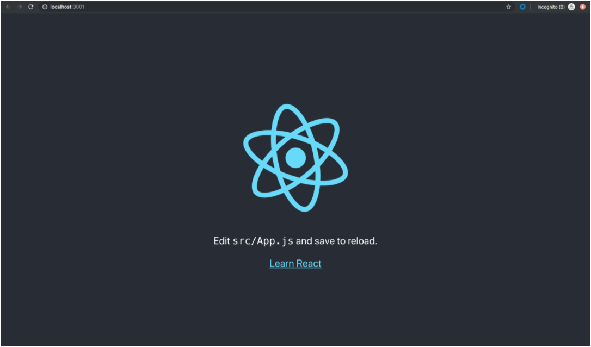

# Hosting Part Two: Buckets/Cloud Storage

*Great spirits have always encountered violent opposition from mediocre minds. —Albert Einstein*

## Overview

Last class we learned about App Engine and how it's a useful tool for deploying our API. Today we are going to talk about another hosting option as we prepare you to segue into the JS411 course and learn about how things work on the frontend.

Google Cloud (and AWS, etc) offer lots of tools to help developers deploy their systems to the cloud. This can seem overwhelming at first as we try to make sense of which each tool should be used for. App Engine works great for APIs (because it's a server) but what about for static files?

## Cloud Storage

Cloud Storage is a bucket for storing files. It could host a collection of HTML, JavaScript, etc files that your frontend uses. Think about it like a folder on your computer . . . that's really all Cloud Storage is. The only difference, obviously, is that these files live in the cloud and not on our local machines.

Feel free to check out the homepage for [Cloud Storage](https://cloud.google.com/storage/) and look at some of its capabilities. We don't need to understand all the information presented (in the doc) at this point.

The question we have to ask right now is: What do we want to put in Cloud Storage? Well, we will use a very popular front-end framework for getting started . . .

## Create React App

The developers at Facebook created a tool for people like us to create React app quickly and easily, it's called: [create-react-app](https://reactjs.org/docs/create-a-new-react-app.html). It gives us all of the boilerplate for a basic React app with one simple command. Before we can use it we need to install create-react-app on our machines. Fortunately the installation is very easy since it's simply an NPM package. So we run the following command: `npm i -g create-react-app`. The "-g" stands for **global**. That means this npm package will be accessible no matter what directory we are in.

The next step is creating the app. We do that with the following command:  `npx create-react-app myApp` where "myApp" is the name of the app/folder you want to create. You'll see that a new folder will be created called "myApp". If we `cd` into that directory and then run `npm start` we will see the app running on localhost!

That's great but what does it have to do with hosting? We will talk more about that in our homework.

<!-- ! Video Contents:  (width="655" height="368", ratio 1.77) -->

## Practice It



- [ ] Globally install create-react-app: `npm i -g create-react-app`
- [ ] Follow the Getting Started instructions on the [React Docs](https://facebook.github.io/create-react-app/docs/getting-started)
- [ ] Use the create-react-app tool to make a new app called "my-first-app": `npx create-react-app my-first-app`
- [ ] `cd` into that folder: `cd my-first-app`
- [ ] and run your app: `npm start`
- [ ] Alter the main page, `app.js` so that it has your name is on it and displays on the screen
- [ ] Test it: `npm start`
- [ ] When satisfied, close the app: ++ctrl+c++

## Additional Resources

- [ ] [YT, Google Cloud Tech - Google Cloud Storage](https://youtu.be/TfOO-fSzTNA)

## Know Your Docs

- [ ] [React Docs - CRA](https://facebook.github.io/create-react-app/docs/getting-started)

<!-- ! END OF VIDEO 101.1.3.1 - TITLE-->
<!-- ? Video Numbering and Title system: CourseNumber.ModuleNumber.LessonNumber.VideoNumber -->
<!-- * (VIDEO 101.2.4.3 - "CSS Selectors") === 101 Course, Module 2, Lesson 4, Video 3 - "CSS Selectors" -->

<!-- 

cp workspace/resources/templateFile.md docs/module- 

```javascript

```

| Method      | Description                          |
| ----------- | ------------------------------------ |
| `GET`       | Fetch resource                       |
| `PUT`       | Update resource |
| `DELETE`    | Delete resource |


    `line numbers`
:do you like 'em?


++slash++
https://facelessuser.github.io/pymdown-extensions/extensions/keys/

=== "Javascript"

    ```javascript
    ```

=== "Python"

  ```python
  ```

=== "Example"
    ```console
      .
    ```

=== "Instructions"
    ```markdown
      .
    ```

=== "Result"
    
-->